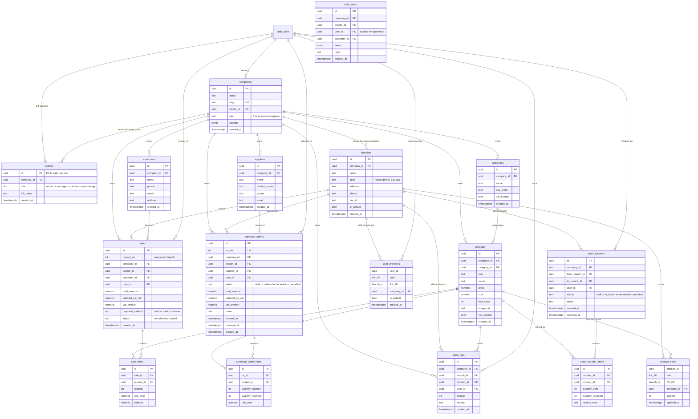

# SEA-POS Feature Specification

> This file is the living spec for sea-pos. Update it whenever a feature is added, changed, or removed.

---

## Project Overview

**SEA-POS** is a Point of Sale (POS) and ERP system targeting Southeast Asian retail, with the UI written in Thai. The system allows store operators to manage inventory, run sales transactions, handle purchasing, manage customers, and view reports.

- **Status:** Foundation + Inventory module complete; ERP modules stubbed
- **Target market:** Thailand / Southeast Asia

---

## Tech Stack

| Layer | Technology |
|-------|-----------|
| Framework | Next.js 16.2.3 (App Router) |
| UI Library | React 19.2.4 |
| Language | TypeScript 5 (strict) |
| Styling | Tailwind CSS 4 + shadcn/ui |
| Icons | lucide-react |
| Database | Supabase (PostgreSQL) |
| DB Client (browser) | `@supabase/ssr` — `createBrowserClient` |
| DB Client (server) | `@supabase/ssr` — `createServerClient` with cookies |
| Auth | Supabase Auth (email/password) |

---

## Architecture

### Rendering model
- Pages are **Server Components** by default — data is fetched on the server, no `useEffect`
- `'use client'` is used only for components that need state, event handlers, or browser APIs
- Mutations go through **Server Actions** (`'use server'`) — no direct client Supabase calls

### Auth layer
- `proxy.ts` (Next.js 16 — replaces `middleware.ts`) refreshes the Supabase session on every request
- Unauthenticated requests to any protected route are redirected to `/login`
- `app/(dashboard)/layout.tsx` performs a belt-and-suspenders auth check via `supabase.auth.getUser()`

### Data flow
```
Server Component page
  └── await createClient()          ← lib/supabase/server.ts
  └── supabase.from('table')...     ← server-side DB query
  └── <ClientComponent data={...}/> ← pass data as props

Client Component (interactive)
  └── calls Server Action            ← lib/actions/*.ts
  └── Server Action: createClient() ← lib/supabase/server.ts
  └── validates auth + mutates DB
  └── revalidatePath() / redirect()  ← triggers server re-render
```

### Environment variables
- `NEXT_PUBLIC_SUPABASE_URL` — Supabase project URL
- `NEXT_PUBLIC_SUPABASE_ANON_KEY` — Supabase anon key (safe for browser)

---

## File Structure

```
sea-pos/
├── proxy.ts                    # Next.js 16 auth proxy (session refresh + redirect)
├── types/
│   └── database.ts             # All DB row, insert, and composite types
├── lib/
│   ├── supabase/
│   │   ├── client.ts           # createBrowserClient factory (Client Components only)
│   │   └── server.ts           # createServerClient factory (Server Components + Actions)
│   ├── actions/
│   │   ├── auth.ts             # signIn, signOut
│   │   ├── inventory.ts        # adjustStock, addProduct, deleteProduct
│   │   ├── pos.ts              # createSale (stub)
│   │   ├── purchasing.ts       # createPurchaseOrder (stub)
│   │   └── customers.ts        # createCustomer (stub)
│   └── utils.ts                # cn() — clsx + tailwind-merge helper
├── components/
│   ├── ui/                     # shadcn/ui primitives
│   ├── layout/
│   │   ├── Sidebar.tsx         # Nav sidebar with active link highlighting
│   │   ├── Header.tsx          # Top bar with user email
│   │   └── DashboardShell.tsx  # Grid wrapper: sidebar + main
│   ├── auth/
│   │   └── LoginForm.tsx       # Login form using useActionState(signIn)
│   └── inventory/
│       ├── ProductTable.tsx     # shadcn Table with stock levels and badges
│       ├── StockAdjustButton.tsx # +/- buttons using useTransition + adjustStock
│       └── AddProductForm.tsx   # Add product form using useActionState(addProduct)
└── app/
    ├── layout.tsx              # Root layout (fonts, metadata)
    ├── globals.css             # Tailwind v4 + shadcn CSS variables
    ├── (auth)/
    │   ├── layout.tsx          # Centered minimal layout (no sidebar)
    │   └── login/page.tsx      # Login page
    └── (dashboard)/
        ├── layout.tsx          # Auth guard + DashboardShell
        ├── page.tsx            # redirect → /inventory
        ├── inventory/
        │   ├── page.tsx        # Stock dashboard (Server Component)
        │   └── add/page.tsx    # Add product page
        ├── pos/page.tsx        # POS (stub)
        ├── purchasing/page.tsx # Purchasing (stub)
        ├── customers/page.tsx  # Customers (stub)
        └── reports/page.tsx    # Reports (stub)
```

---

## User Roles

Role-based access control is implemented via the `profiles` table + Supabase RLS.

| Role | Thai | Access |
|------|------|--------|
| `admin` | ผู้ดูแลระบบ | Full access — all modules + user role management |
| `manager` | ผู้จัดการร้าน | Inventory, POS, Purchasing, Reports — cannot delete users |
| `cashier` | พนักงานเก็บเงิน | POS only — create sales, view products/customers |
| `purchasing` | เจ้าหน้าที่จัดซื้อ | Purchase orders + suppliers only |

Roles are set in `raw_user_meta_data` at signup and synced to `profiles` via a DB trigger (`handle_new_user`). The `get_user_role()` SQL function is used in all RLS policies.

### Test Accounts (password: `Test1234!`)

| Email | Role |
|-------|------|
| `admin@sea-pos.test` | admin |
| `manager@sea-pos.test` | manager |
| `cashier@sea-pos.test` | cashier |
| `purchasing@sea-pos.test` | purchasing |

---

## Database Schema

> All tables are defined across `supabase/001_schema.sql` through `supabase/009_multitenancy.sql`. Seed data (test accounts + sample products) is in `supabase/reset_and_demo.sql`.

### Entity-Relationship Diagram



**Conventions:**
- Every row has a `company_id` except `sale_items`, `purchase_order_items`, and `stock_transfer_items`, which inherit tenancy through their parent's `company_id` (cheaper than duplicating + enforced by RLS EXISTS joins).
- `auth_users` in the diagram is Supabase's built-in `auth.users` table (outside our `public` schema).
- Soft-foreign-keys like `stock_logs.reason` (freeform text referencing `PO-00042`, `sale_id[:8]`, or `โอน #<id>`) are not shown.
- Stock lives in `product_stock` (per-branch pivot, PK `(product_id, branch_id)`) — `products.stock` was dropped in migration 014.
- **Receipt numbering is per-branch** (R2): `UNIQUE (branch_id, receipt_no)`. Display format: `{branch.code}-{padded}` e.g. `B01-00042`. PO numbers stay company-wide.
- **VAT breakdown** on `sales`: `total_amount = subtotal_ex_vat + vat_amount`; historical rows have `vat_amount = 0`. Effective exemption per line is `product.vat_exempt OR category.vat_exempt`.


### `profiles`

| Column | Type | Notes |
|--------|------|-------|
| id | uuid | PK, FK → auth.users.id |
| role | text | `'admin'` \| `'manager'` \| `'cashier'` \| `'purchasing'` |
| full_name | text \| null | Display name |
| created_at | timestamptz | |

### `products`

| Column | Type | Notes |
|--------|------|-------|
| id | uuid | Primary key |
| sku | text | Stock-keeping unit identifier |
| name | text | Product display name |
| price | numeric(12,2) | Selling price (default 0) |
| cost | numeric(12,2) | Purchase cost (default 0) |
| min_stock | integer | Low-stock warning threshold (default 0) |
| image_url | text \| null | Optional product image URL |
| vat_exempt | boolean | ยกเว้น VAT override for this product (R2) |
| created_at | timestamptz | Record creation time |

> Stock is **not** on this table — see [`product_stock`](#product_stock).

### `product_stock`

Per-branch stock pivot (migration 014). PK `(product_id, branch_id)` — one row per product/branch combination.

| Column | Type | Notes |
|--------|------|-------|
| product_id | uuid | FK → products.id |
| branch_id | uuid | FK → branches.id |
| company_id | uuid | FK → companies.id |
| quantity | integer | `>= 0` CHECK; updated atomically via RPCs |
| updated_at | timestamptz | |

### `stock_logs`

| Column | Type | Notes |
|--------|------|-------|
| id | uuid | Primary key |
| product_id | uuid | FK → products.id |
| branch_id | uuid | FK → branches.id — NOT NULL after migration 014 |
| change | integer | Stock delta (positive = added, negative = removed) |
| reason | text \| null | e.g. `'ขาย #<id>'`, `'รับของจาก PO'`, `'โอนออก (โอน #<id>)'` |
| user_id | uuid \| null | FK → auth.users.id |
| created_at | timestamptz | Log entry time |

Ledger invariant: `Σ stock_logs.change == product_stock.quantity` per `(product, branch)`. Transfer shortfalls are NOT logged here — they live on `stock_transfer_items.receive_note` to preserve reconciliation.

### `customers`

| Column | Type | Notes |
|--------|------|-------|
| id | uuid | Primary key |
| name | text | |
| phone | text \| null | |
| email | text \| null | |
| address | text \| null | |
| created_at | timestamptz | |

### `suppliers`

| Column | Type | Notes |
|--------|------|-------|
| id | uuid | Primary key |
| name | text | |
| contact_name | text \| null | |
| phone | text \| null | |
| email | text \| null | |
| created_at | timestamptz | |

### `sales`

| Column | Type | Notes |
|--------|------|-------|
| id | uuid | Primary key |
| receipt_no | integer | Per-branch counter — `UNIQUE (branch_id, receipt_no)` after R2 |
| customer_id | uuid \| null | FK → customers.id (nullable for walk-in) |
| user_id | uuid | FK → auth.users.id (cashier) |
| branch_id | uuid | FK → branches.id (R2 — NOT NULL) |
| total_amount | numeric(12,2) | Gross total shown to the customer |
| subtotal_ex_vat | numeric(12,2) | Net (pre-VAT) portion (R2) |
| vat_amount | numeric(12,2) | VAT portion; 0 for mode=none or exempt-only carts (R2) |
| payment_method | text | `'cash'` \| `'card'` \| `'transfer'` |
| status | text | `'completed'` \| `'voided'` |
| created_at | timestamptz | |

### `sale_items`

| Column | Type | Notes |
|--------|------|-------|
| id | uuid | Primary key |
| sale_id | uuid | FK → sales.id ON DELETE CASCADE |
| product_id | uuid | FK → products.id |
| quantity | integer | |
| unit_price | numeric(12,2) | Price at time of sale (snapshot) |
| subtotal | numeric(12,2) | quantity × unit_price |

### `purchase_orders`

| Column | Type | Notes |
|--------|------|-------|
| id | uuid | Primary key |
| po_no | integer | Company-wide counter |
| supplier_id | uuid | FK → suppliers.id |
| user_id | uuid | FK → auth.users.id |
| branch_id | uuid | FK → branches.id — destination for the received stock (R2) |
| status | text | `'draft'` \| `'ordered'` \| `'received'` \| `'cancelled'` |
| total_amount | numeric(12,2) | Gross paid to supplier |
| subtotal_ex_vat | numeric(12,2) | Net (pre-VAT) portion — input VAT claim base (migration 019) |
| vat_amount | numeric(12,2) | Input VAT (ภาษีซื้อ); 0 for mode=none or fully exempt POs |
| notes | text \| null | |
| ordered_at | timestamptz \| null | |
| received_at | timestamptz \| null | Drives the VAT report's input-VAT date filter |
| created_at | timestamptz | |

### `purchase_order_items`

| Column | Type | Notes |
|--------|------|-------|
| id | uuid | Primary key |
| po_id | uuid | FK → purchase_orders.id ON DELETE CASCADE |
| product_id | uuid | FK → products.id |
| quantity_ordered | integer | |
| quantity_received | integer | default 0 |
| unit_cost | numeric(12,2) | |

### `branches` (R2)

Physical store locations. One row per branch. `UNIQUE (company_id, code)` and `is_default` is unique per company.

| Column | Type | Notes |
|--------|------|-------|
| id | uuid | Primary key |
| code | text | Receipt prefix (e.g. `B01`) |
| name | text | Display name |
| address, phone, tax_id | text \| null | Printed on the per-branch receipt block |
| is_default | boolean | Exactly one `true` per company |

### `user_branches` (R2)

Many-to-many mapping between `auth.users` and `branches`. PK `(user_id, branch_id)`.

| Column | Type | Notes |
|--------|------|-------|
| user_id | uuid | FK → auth.users.id |
| branch_id | uuid | FK → branches.id |
| is_default | boolean | One default per user — drives the initial `activeBranchId` |

### `stock_transfers` (R2)

| Column | Type | Notes |
|--------|------|-------|
| id | uuid | Primary key |
| from_branch_id | uuid | FK → branches.id |
| to_branch_id | uuid | FK → branches.id — `CHECK (from_branch_id <> to_branch_id)` |
| user_id | uuid | FK → auth.users.id (initiator) |
| status | text | `'draft'` \| `'in_transit'` \| `'received'` \| `'cancelled'` |
| notes | text \| null | |
| received_at | timestamptz \| null | |

### `held_sales`

Parked cart for พักบิล. One row = one in-progress sale that a cashier paused.

| Column | Type | Notes |
|--------|------|-------|
| id | uuid | Primary key |
| branch_id | uuid | FK → branches.id — bill can only be resumed at the same branch |
| user_id | uuid | FK → auth.users.id — cashier who parked it |
| customer_id | uuid \| null | FK → customers.id (nullable for walk-in) |
| items | jsonb | `[{ productId, name, price, quantity, vatExempt }]` — full cart snapshot |
| note | text \| null | Optional label ("คุณสมชาย", "โต๊ะ 3") |
| created_at | timestamptz | |

Lifecycle: INSERT on hold, DELETE on resume or explicit trash — UPDATE is blocked by RLS (resume = delete + re-hydrate).

### `stock_transfer_items` (R2)

| Column | Type | Notes |
|--------|------|-------|
| transfer_id | uuid | FK → stock_transfers.id ON DELETE CASCADE |
| product_id | uuid | FK → products.id |
| quantity_sent | integer | `> 0` |
| quantity_received | integer | `0..quantity_sent` — populated on receive |
| receive_note | text \| null | Discrepancy note when `quantity_received < quantity_sent` |

**RLS:** company-scoped baseline from [009_multitenancy.sql](supabase/009_multitenancy.sql), branch-aware tightening in [017_branch_rls.sql](supabase/017_branch_rls.sql). Non-admins can only read/write rows at branches listed in their `user_branches`; `is_company_admin()` and `is_platform_admin()` bypass for cross-branch reporting. See the User Roles section for the role matrix.

---

## Multi-tenancy (Release 1)

SEA-POS is a **B2B SaaS** — every customer is a company (tenant) with its own isolated dataset. Multiple users per company, full data separation.

### Model

| Table | Role |
|---|---|
| `companies` | One row per customer organization. Owner, plan, slug, settings jsonb. |
| `profiles.company_id` | Every user belongs to exactly one company. |
| All business tables | Have `company_id UUID NOT NULL` referencing `companies(id)`. |

### Isolation

Enforced by PostgreSQL **Row-Level Security** on every table:

```sql
USING (company_id = get_current_company_id())
WITH CHECK (company_id = get_current_company_id() AND get_user_role() IN ('...'))
```

`get_current_company_id()` is a SECURITY DEFINER function that resolves the current user's `profiles.company_id`. Even if app code forgets to filter, the database refuses cross-tenant reads and rejects cross-tenant inserts.

### Signup flow

- **Self-serve signup** — `handle_new_user` trigger creates a fresh `companies` row, the user becomes its owner with `role='admin'`.
- **Invitation** — admin includes `company_id` in the invited user's `auth.users.raw_user_meta_data`. Trigger attaches them to that company instead of creating a new one.

### Code surface

- `AuthedUser.companyId` — current user's tenant, available via [`requirePageRole` / `requireActionRole`](lib/auth.ts)
- `companyRepo` — read/update the current company (via [contracts/company.ts](lib/repositories/contracts/company.ts))
- Every other repo filters by `company_id` **transparently** via RLS — no code change needed in pages/actions

### Migration files

- [supabase/009_multitenancy.sql](supabase/009_multitenancy.sql) — adds `companies`, `company_id` columns, RLS rewrite. Backfills existing data into a `Legacy` company.
- [supabase/010_signup.sql](supabase/010_signup.sql) — `handle_new_user` reads optional `company_name` from metadata (self-serve signup).

### Pages

- **`/signup`** — self-serve onboarding. Gated by `NEXT_PUBLIC_ENABLE_SIGNUP`. When `false` (MVP1 default), returns 404; platform admin creates every company. When `true`, `handle_new_user` creates a fresh company with the user as owner.
- **`/login`** — email/password. Shows the `/signup` link only when the env flag is on.
- **`/settings/company`** — admin-only. Company name + contact info + receipt header/footer, stored in `companies.settings` jsonb.
- **`/users`** — admin creates staff. Passes `company_id` through metadata so invitees attach to the admin's tenant.

### Platform admin (invite-only MVP1 model)

- **`companies.status`** — lifecycle states: `pending`, `active`, `suspended`, `closed`. Enforced by middleware: non-active company users land on `/blocked`.
- **`profiles.is_platform_admin`** + `is_platform_admin()` SQL helper — SECURITY DEFINER function used in every RLS policy (`USING (is_platform_admin() OR company_id = get_current_company_id())`). Platform admins see and operate across all tenants.
- **Bootstrap account** — migration 011 seeds `platform@sea-pos.com` (password `PlatformAdmin1234!`). Change via SQL (see migration header comment) or grant the flag to an existing user.
- **`/platform/companies`** — list all companies with owner / user count / status.
- **`/platform/companies/new`** — platform admin creates a company + first admin user in one form. Company is created `active` (already vetted).
- **`/platform/companies/[id]`** — detail + activate/suspend/close controls.
- **`/blocked`** — dead-end page for non-active-company users (pending review / suspended / closed messages + sign out).

### Migration files for R1

- [supabase/009_multitenancy.sql](supabase/009_multitenancy.sql)
- [supabase/010_signup.sql](supabase/010_signup.sql)
- [supabase/011_platform_admin.sql](supabase/011_platform_admin.sql) — platform admin role + company.status + RLS bypass
- [supabase/012_plans_config.sql](supabase/012_plans_config.sql) — `plans` config table, `companies.plan` FK, seed 4 tiers
- [supabase/014_multi_branch.sql](supabase/014_multi_branch.sql) — `branches`, `product_stock` pivot, `user_branches`, per-branch receipt numbering, branch-aware RLS for stock/branches/transfers
- [supabase/015_stock_transfers.sql](supabase/015_stock_transfers.sql) — send/receive/cancel transfer RPCs
- [supabase/016_transfer_partial_receive.sql](supabase/016_transfer_partial_receive.sql) — partial-receive + discrepancy notes
- [supabase/017_branch_rls.sql](supabase/017_branch_rls.sql) — tightens `sales`/`purchase_orders`/`stock_logs` + child tables to branch scope. Non-admins can only see/mutate rows at a branch they're assigned to; `is_company_admin()` and `is_platform_admin()` bypass the branch check for cross-branch reporting.
- [supabase/018_vat.sql](supabase/018_vat.sql) — VAT: `categories.vat_exempt`, `products.vat_exempt`, `sales.subtotal_ex_vat` + `sales.vat_amount`. Company-level VAT mode/rate live in `companies.settings` JSONB (`vat_mode`: `none`/`included`/`excluded`, `vat_rate`: percent).
- [supabase/019_purchase_vat.sql](supabase/019_purchase_vat.sql) — Purchase VAT: `purchase_orders.subtotal_ex_vat` + `purchase_orders.vat_amount`. Mirror of 018 on the input (ภาษีซื้อ) side.
- [supabase/020_product_barcode.sql](supabase/020_product_barcode.sql) — `products.barcode` + partial unique index per company. Separate from `sku` (SKU is internal, barcode is the printed EAN/UPC).
- [supabase/021_held_sales.sql](supabase/021_held_sales.sql) — `held_sales` (พักบิล) table + branch-aware RLS. Parks an in-progress cart as JSONB; resume deletes the row and re-hydrates the live cart. Not a `status='held'` on `sales` so the sales ledger, receipt numbering, and VAT reports stay clean.

### Money & decimal precision

All monetary arithmetic in the app **must** go through [lib/money.ts](lib/money.ts) (`money`, `moneyStr`, `add`, `sub`, `mul`, `div`, `sum`, `sumBy`, `lineTotal`, `average`, `chain`). The helpers are thin wrappers over [decimal.js](https://github.com/MikeMcl/decimal.js) with `ROUND_HALF_UP` and a 2-decimal-place boundary — matching Thai baht convention (satang is 0.01).

**Why:** JavaScript's IEEE-754 floats produce silent drift on common POS expressions — `0.1 + 0.2 = 0.30000000000000004`, `2.39 * 3 = 7.170000000000001`. At a 7% VAT rate those errors compound, and since sales and POs are persisted to `NUMERIC(12,2)`, a drifted client value can cause receipt / DB mismatch or mis-filed ภ.พ.30 returns.

**Rule of thumb:** never write `a + b`, `price * qty`, `/`, or `.toFixed(2)` on a money value in app code. Use `add(a, b)`, `lineTotal(price, qty)`, `div(x, y)`, `moneyStr(x)`. Stock quantities, counts, and pagination math remain plain `number` — only money runs through Decimal.

Covered sites: [lib/vat.ts](lib/vat.ts) (VAT inclusive/exclusive split), [lib/actions/pos.ts](lib/actions/pos.ts) (sale line subtotals), [lib/actions/purchasing.ts](lib/actions/purchasing.ts) (PO totals), [lib/repositories/supabase/analytics.ts](lib/repositories/supabase/analytics.ts) (revenue sums, averages, stock value, VAT summary), [components/pos/POSTerminal.tsx](components/pos/POSTerminal.tsx) (cart line), [components/purchasing/POLineEditor.tsx](components/purchasing/POLineEditor.tsx) (line editor total), [app/(dashboard)/customers/*](app/(dashboard)/customers), [app/(dashboard)/purchasing/[id]/page.tsx](app/(dashboard)/purchasing/%5Bid%5D/page.tsx), [app/api/reports/export/route.ts](app/api/reports/export/route.ts) (CSV amounts).

### VAT

Three-level model. Company sets default (`/settings/company` → "ภาษีมูลค่าเพิ่ม"): `none` disables VAT everywhere; `excluded` adds VAT on top of listed prices at checkout; `included` keeps listed prices gross and breaks VAT out for reporting. Per-category ยกเว้น VAT checkbox at [/inventory/categories](app/(dashboard)/inventory/categories/page.tsx) covers an entire category; per-product override on [AddProductForm](components/inventory/AddProductForm.tsx) wins when set.

Effective exemption per line = `product.vat_exempt OR category.vat_exempt`. Pure helper lives in [lib/vat.ts](lib/vat.ts) (`getVatConfig`, `computeVat`). POS recomputes the breakdown from the authoritative server state in [createSale](lib/actions/pos.ts) via `productRepo.vatExemptMap(ids)` — a client-supplied flag is not trusted. Receipts display the breakdown only when `sale.vat_amount > 0`.

**Purchase side (ภาษีซื้อ / input VAT).** [purchasing.ts](lib/actions/purchasing.ts) mirrors the POS flow: `createPurchaseOrder` and `updatePurchaseOrder` call `computePoBreakdown()` which re-resolves each product's effective exemption server-side and stores `subtotal_ex_vat` + `vat_amount` on `purchase_orders`. The PO line editor ([POLineEditor](components/purchasing/POLineEditor.tsx)) shows a live net/VAT/gross preview using the current company config. The PO detail page ([app/(dashboard)/purchasing/[id]/page.tsx](app/(dashboard)/purchasing/%5Bid%5D/page.tsx)) auto-recomputes `draft` POs silently on read when the company VAT config has drifted from what was stored — `ordered` / `received` / `cancelled` POs stay frozen for audit integrity.

**VAT report** ([app/(dashboard)/reports/page.tsx](app/(dashboard)/reports/page.tsx)) — visible only when `vat_mode ≠ 'none'`. Three cards:
- Output row — completed sales: `netSales`, `vatOutput`, `grossSales`, vat/exempt bill counts
- Input row — `received` POs (date-filtered by `received_at`): `netPurchases`, `vatInput`, `grossPurchases`, vat/exempt PO counts. Draft/ordered POs are excluded until goods are in-hand (tax invoice realized).
- Net liability — `vatOutput − vatInput` via `sub()` in [lib/money.ts](lib/money.ts); negative means carry-forward / refund claim.

CSV export (`kind=vat`) produces a single sheet with OUTPUT rows, an OUTPUT TOTAL, INPUT rows, an INPUT TOTAL, and a final `NET VAT_PAYABLE` row — ready for ภ.พ.30 prep.

### Plans & limits

Plan tiers are stored in the **`plans`** table (not hardcoded), so platform admins can rename, re-price, or adjust limits without code changes.

| code | name | max_products | max_users | max_branches | monthly_price |
|---|---|---|---|---|---|
| `free` | ฟรี | 50 | 3 | 1 | ฿0 |
| `lite_pro` | โปร Lite | 300 | 10 | 2 | ฿399 |
| `standard_pro` | โปร Standard | 1,500 | 50 | 5 | ฿990 |
| `enterprise` | องค์กร | unlimited | unlimited | unlimited | Contact us |

**Enforcement** is in `lib/limits.ts`. `addProduct` and `createUser` server actions call `checkProductLimit` / `checkUserLimit` before insert; when the cap is reached they return `formatLimitError(...)` in Thai. `max_branches` is reserved for Release 2.

**Platform admin UI** at `/platform/plans` allows editing every tier inline — name, description, price, and the three limits. Leaving a limit field empty stores `NULL` meaning unlimited. A plan can be marked inactive to hide it from the picker without deleting any company references.

**Customer UI** — `/settings/company` shows live usage cards ("23 / 50 สินค้า") with progress bars turning amber at 80% and red at 100%. The admin sees a clear "ใช้เต็มแล้ว" badge long before they hit the hard error from the action.

---

## Architecture Contract

**UI never touches Supabase.** Every `.from(...)`, `.rpc(...)`, and `.auth.*` call lives in exactly one of three zones:

| Zone | Allowed |
|---|---|
| [lib/repositories/**](lib/repositories/) | All domain data access (products, customers, sales, POs, analytics, auth, users) |
| [lib/auth.ts](lib/auth.ts) | Trust anchor: reads the validated user from request headers + one `profiles` lookup |
| [proxy.ts](proxy.ts) | Middleware: validates Supabase session on every request, injects `x-sea-user-id` header |

Pages, components, and server actions go through:
- [`requirePageRole(roles)` / `requireActionRole(roles)` / `requirePage()` / `getActionUser()`](lib/auth.ts) for auth
- Repositories imported from [`@/lib/repositories`](lib/repositories/) for data

Audit command:
```bash
# Should return only lib/repositories/**, lib/auth.ts, proxy.ts
grep -rn "\.from(['\"]|\.rpc(['\"]|\.auth\." --include="*.ts" --include="*.tsx"
```

Swapping Supabase for another backend means rewriting `lib/repositories/` + `lib/auth.ts` + `proxy.ts` only. Pages and components stay untouched.

---

## Pagination & Search

All list pages use **server-side offset pagination** with URL-driven state. The convention is shared across every listing.

### URL parameters

| Param | Purpose | Default | Allowed values |
|---|---|---|---|
| `page` | 1-indexed page number | `1` | positive integer |
| `pageSize` | rows per page | `20` | `10`, `20`, `50`, `100` |
| `q` | free-text search (where supported) | none | any string |
| `status` | filter by status (PO list) | none | `draft`, `ordered`, `received`, `cancelled` |
| `category` | filter by category (inventory) | none | category UUID |

Example: `/customers?q=สมชาย&page=2&pageSize=50`

### Shared library

- [lib/pagination.ts](lib/pagination.ts): `parsePageParams`, `toSupabaseRange`, `packPaginated`, `Paginated<T>` type
- [components/ui/pagination.tsx](components/ui/pagination.tsx): reusable navigator — preserves all other query params when linking to a new page, shows row window (`1 – 20 จาก 347`), ellipsis for large page counts

### Repo pattern

Paginated methods live alongside the full-list methods (kept for POS terminal and other contexts that genuinely need all rows). Each returns `{ rows, totalCount, page, pageSize, totalPages }` in a single Supabase query (`count: 'exact'` + `.range(from, to)`).

| Repo | Paginated method | Extra filters |
|---|---|---|
| `productRepo` | `listWithCategoryPaginated` | `categoryId` |
| `customerRepo` | `listPaginated` | `search` (ILIKE across name/phone/email) |
| `supplierRepo` | `listPaginated` | — |
| `saleRepo` | `listRecentPaginated` | — |
| `purchaseOrderRepo` | `listRecentPaginated` | `status` |

### Search UX (customers)

[CustomerSearch](components/customers/CustomerSearch.tsx) debounces input by 300ms, then pushes `?q=…&page=1` via `router.push` inside `useTransition`. Each keystroke (after debounce) runs a server-side ILIKE query — escapes `%` and `_` before concatenating wildcards to prevent pattern injection. Backspacing to empty removes the `q` param entirely.

### Streaming

Each paginated table is wrapped in `<Suspense key={…}>` with a `TableSkeleton` fallback. The key includes all pagination/filter values, so page navigation + filter changes show a skeleton instead of a blank flash while the new query runs. The page shell (header, action buttons) stays static and renders instantly.

### Paginated routes

| Route | Extra params |
|---|---|
| [/inventory](app/(dashboard)/inventory/page.tsx) | `category` |
| [/customers](app/(dashboard)/customers/page.tsx) | `q` |
| [/purchasing](app/(dashboard)/purchasing/page.tsx) | `status` |
| [/purchasing/suppliers](app/(dashboard)/purchasing/suppliers/page.tsx) | — |
| [/pos/sales](app/(dashboard)/pos/sales/page.tsx) | — |

---

## Features

### Authentication

- **Purpose:** Protect all routes; only authenticated users can access the dashboard.
- **Routes/Files:** `/login` → [app/(auth)/login/page.tsx](app/(auth)/login/page.tsx), [components/auth/LoginForm.tsx](components/auth/LoginForm.tsx)
- **Behavior:** Email/password login via Supabase Auth. Session managed via HTTP-only cookies (handled by `proxy.ts` + `@supabase/ssr`). Logout via sidebar button.

### Stock Management Dashboard

- **Purpose:** Central view for monitoring and adjusting product stock levels.
- **Routes/Files:** `/inventory` → [app/(dashboard)/inventory/page.tsx](app/(dashboard)/inventory/page.tsx)
- **Behavior:**
  - Server Component fetches all products ordered by name
  - Displays name, SKU, stock, min_stock, and status badge (ปกติ / ใกล้หมด)
  - **+** / **−** buttons adjust stock by 1 via `adjustStock` Server Action
  - Each stock change updates `products.stock` and inserts a `stock_logs` row with `user_id`
  - Stock cannot go below 0 (guarded in Server Action)
  - Page re-renders automatically via `revalidatePath('/inventory')`

### Add Product

- **Purpose:** Add new products to the catalog.
- **Routes/Files:** `/inventory/add` → [app/(dashboard)/inventory/add/page.tsx](app/(dashboard)/inventory/add/page.tsx)
- **Behavior:**
  - Fields: name (required), SKU, min_stock
  - Validates name is not empty; inserts with `stock: 0`
  - On success: redirects to `/inventory`
  - Inline error display via `useActionState`

### Sales / POS

- **Purpose:** Touch-friendly cart + checkout at the counter. Cashier picks items from a paginated, branch-scoped grid, adds a customer (optional), picks a payment method, and lands on a printable receipt.
- **Routes/Files:**
  - `/pos` → [app/(dashboard)/pos/page.tsx](app/(dashboard)/pos/page.tsx) + [POSTerminal](components/pos/POSTerminal.tsx)
  - `/pos/sales` → [app/(dashboard)/pos/sales/page.tsx](app/(dashboard)/pos/sales/page.tsx) — recent sales list with branch scope toggle
  - `/pos/receipt/[saleId]` → printable receipt with per-branch header block + VAT breakdown
  - Actions: [lib/actions/pos.ts](lib/actions/pos.ts) (`createSale`, `voidSale`, `searchInStockProducts`)
- **Stock flow:** `createSale` inserts header + items, then calls the `decrement_stock` RPC once per line. The RPC is SECURITY DEFINER, locks the `product_stock` row for `(product, activeBranch)`, validates `qty <= stock`, decrements, and writes a `stock_logs` row (reason `'ขาย #<id>'`). Void reverses stock via `productStockRepo.adjust` with reason `'ยกเลิกออเดอร์ #...'` — on the sale's original branch.
- **Receipt numbering (R2):** `sales.receipt_no` is unique per branch. Display is `{branch.code}-{padded}` (e.g. `B01-00042`) via [formatReceiptNo](lib/format.ts).
- **VAT (R2):** server recomputes VAT from company settings + `productRepo.vatExemptMap(ids)` (never trusts client). Stores `subtotal_ex_vat` + `vat_amount` on the sale; receipt shows the breakdown only when `vat_amount > 0`. See the VAT section for the modes and rules.
- **Money safety:** every line subtotal, cart total, and VAT computation routes through [lib/money.ts](lib/money.ts) (decimal.js). See "Money & decimal precision".
- **Barcode / SKU scan:** Enter in the search input = scan commit — `findProductByCode` matches `barcode` exactly first, falls back to case-insensitive SKU. Native `<input>` is used (not the shadcn wrapper) because the base-ui primitive eats Enter before it bubbles to our handler. Auto-focus on mount + after each add so keyboard-wedge scanners chain scans.
- **พักบิล / hold:** "พักบิล" button in the cart footer saves the cart + customer + optional note to `held_sales`; "บิลที่พักไว้" drawer in the cart header lists parked bills for the active branch. See the Held Sales section for details.

### Held Sales (พักบิล)

- **Purpose:** Let a cashier park an in-progress cart to serve the next customer, then resume it later. Classic busy-lane Thai-shop need.
- **Routes/Files:**
  - [components/pos/HeldSalesDrawer.tsx](components/pos/HeldSalesDrawer.tsx) — "บิลที่พักไว้" button + slide-in list
  - Hold + resume wired inside [components/pos/POSTerminal.tsx](components/pos/POSTerminal.tsx) — "พักบิล" button in the cart footer, "บิลที่พักไว้" badge in the cart header
  - [lib/actions/heldSales.ts](lib/actions/heldSales.ts) — `holdSale`, `listHeldSales`, `resumeHeldSale`, `deleteHeldSale`
  - [supabase/021_held_sales.sql](supabase/021_held_sales.sql) — schema + branch-aware RLS
- **Roles:** admin, manager, cashier — anyone who can ring a sale.
- **Data model:** `held_sales` is a standalone table (not a status on `sales`). The cart is stored as JSONB (`[{ productId, name, price, quantity, vatExempt }]`). Stock hasn't moved, no receipt number has been issued — parking a bill is purely an intent record.
- **Flow:**
  - **Hold** — cashier clicks พักบิล → optional note prompt ("คุณสมชาย", "โต๊ะ 3") → row inserted with the cart snapshot + customer + note → live cart blanked
  - **Resume** — cashier opens the drawer → taps a bill → row is deleted and the cart re-hydrated on the POS. Refuses resume if the bill's branch ≠ cashier's active branch. Confirms before replacing a non-empty current cart.
  - **Delete** — trash icon on each drawer row hard-deletes.
- **Safety:** stock is re-validated at checkout via the usual `decrement_stock` RPC — if another cashier sold the last unit while the bill was parked, checkout errors cleanly instead of going negative. UPDATE is intentionally not allowed by RLS (resume = delete + re-hydrate), so there's no "edit parked bill" drift.
- **Out of scope (future):** auto-expiry cleanup (nightly job), printing a placeholder slip, cross-branch holds.

### Branches (R2)

- **Purpose:** Let one company operate multiple physical stores with isolated stock, sales, and numbering.
- **Routes/Files:**
  - `/settings/branches` — branch CRUD (admin only)
  - [components/layout/BranchPicker.tsx](components/layout/BranchPicker.tsx) — top-bar switch
  - [components/layout/BranchScopeToggle.tsx](components/layout/BranchScopeToggle.tsx) — admin-only "สาขาของฉัน / ทุกสาขา" pill on list views (uses `?branch=all`)
  - [lib/branch-filter.ts](lib/branch-filter.ts) — resolves the effective `branchId` per caller + URL param
  - [components/users/BranchMultiSelect.tsx](components/users/BranchMultiSelect.tsx) — multi-branch assignment on `/users`
- **Data model:** branches sit under `companies`; each user ↔ branch via `user_branches`. Active branch is selected via the `sea-branch` cookie, injected as `x-sea-branch` header by [proxy.ts](proxy.ts), validated in [lib/auth.ts](lib/auth.ts) against the user's assigned set.
- **UX rules:** cashiers with one branch see no picker. Admins default to their last-used branch. A user with zero branches is sent to `/no-branch`. List views are branch-scoped; admin toggle unlocks cross-branch aggregation.

### Stock Transfers (R2)

- **Purpose:** Move stock between branches with an auditable paper trail.
- **Routes/Files:** `/inventory/transfers` (list) · `/inventory/transfers/new` (create) · `/inventory/transfers/[id]` (detail + receive/cancel). Components: [TransferCreateForm](components/inventory/TransferCreateForm.tsx), [TransferLineEditor](components/inventory/TransferLineEditor.tsx), [TransferActions](components/inventory/TransferActions.tsx), [TransferReceiveForm](components/inventory/TransferReceiveForm.tsx). Actions: [lib/actions/stockTransfers.ts](lib/actions/stockTransfers.ts).
- **Lifecycle:** `draft → in_transit → received | cancelled`. Create action immediately calls `send_stock_transfer`; a failed send rolls back the header.
- **Partial receive:** destination manager can enter per-item `quantity_received` + a discrepancy `receive_note`. Shortfalls are tracked on `stock_transfer_items.receive_note` only — **not** written to `stock_logs` (preserves the ledger reconciliation invariant).
- **Atomicity:** RPCs in [015_stock_transfers.sql](supabase/015_stock_transfers.sql) / [016_transfer_partial_receive.sql](supabase/016_transfer_partial_receive.sql) use `FOR UPDATE` locks and write `stock_logs` rows (`'โอนออก #...'`, `'รับโอน #...'`) at the affected branches.

### Purchasing

- **Purpose:** Full purchase-order lifecycle — from drafting to supplier confirmation to partial goods receiving that updates stock automatically.
- **Routes/Files:**
  - `/purchasing` → [app/(dashboard)/purchasing/page.tsx](app/(dashboard)/purchasing/page.tsx) — PO list with status filter tabs
  - `/purchasing/new` → [app/(dashboard)/purchasing/new/page.tsx](app/(dashboard)/purchasing/new/page.tsx) — create draft PO
  - `/purchasing/[id]` → [app/(dashboard)/purchasing/[id]/page.tsx](app/(dashboard)/purchasing/%5Bid%5D/page.tsx) — detail, edit/confirm/cancel/receive
  - `/purchasing/suppliers` → [app/(dashboard)/purchasing/suppliers/page.tsx](app/(dashboard)/purchasing/suppliers/page.tsx) — supplier CRUD
  - Actions: [lib/actions/purchasing.ts](lib/actions/purchasing.ts) (`createPurchaseOrder`, `updatePurchaseOrder`, `confirmPurchaseOrder`, `cancelPurchaseOrder`, `receivePurchaseOrder`), [lib/actions/suppliers.ts](lib/actions/suppliers.ts) (`addSupplier`, `updateSupplier`, `deleteSupplier`)
  - Components: [POList](components/purchasing/POList.tsx), [POForm](components/purchasing/POForm.tsx), [POLineEditor](components/purchasing/POLineEditor.tsx), [POActions](components/purchasing/POActions.tsx), [ReceiveForm](components/purchasing/ReceiveForm.tsx), [SupplierTable](components/purchasing/SupplierTable.tsx), [SupplierForm](components/purchasing/SupplierForm.tsx)
  - Helpers: [lib/po.ts](lib/po.ts) (`formatPoNo`, status labels/variants)
- **Roles:** admin, manager, purchasing for all operations; only admin can delete suppliers.
- **Status machine:** `draft → ordered → received`, plus `draft|ordered → cancelled`. Status transitions are enforced server-side in each action.
- **Document numbering:** `purchase_orders.po_no` is an auto-incremented `INTEGER` via `po_number_seq`, formatted `PO-00001` in the UI (same pattern as `receipt_no`).
- **Receiving flow (partial):** on an `ordered` PO, [ReceiveForm](components/purchasing/ReceiveForm.tsx) lets the user enter a qty per line (≤ remaining). On submit, the action calls the SECURITY DEFINER RPC `receive_po_item(item_id, qty, user_id)` which: (1) locks the PO line, (2) validates qty against outstanding, (3) increments `products.stock`, (4) updates `quantity_received`, (5) writes a `stock_logs` row (`รับของจาก PO-XXXXX`), (6) auto-flips PO status to `received` and stamps `received_at` when every line is complete.
- **Why SECURITY DEFINER:** the purchasing role is not allowed to UPDATE `products` directly via RLS — the RPC bypasses this safely with validated inputs, mirroring the `decrement_stock` pattern used by POS.
- **Schema migration:** [supabase/006_purchasing.sql](supabase/006_purchasing.sql) adds `po_number_seq`, `purchase_orders.po_no`, `purchase_orders.notes`, the `receive_po_item` function, and a `purchase_order_items_delete` RLS policy (needed so drafts can be re-edited by replacing their line items). [019_purchase_vat.sql](supabase/019_purchase_vat.sql) adds VAT breakdown columns (`subtotal_ex_vat`, `vat_amount`) for input-VAT reporting.
- **Purchase VAT:** create/update actions re-resolve each product's effective exemption server-side and store the breakdown. Draft POs auto-recompute on detail-page read if the company VAT config has drifted. See the VAT section for the full flow.

### Customers

- **Purpose:** CRM module — manage customer profiles, view per-customer purchase history, and attach a customer to a sale at checkout.
- **Routes/Files:**
  - `/customers` → [app/(dashboard)/customers/page.tsx](app/(dashboard)/customers/page.tsx)
  - `/customers/[id]` → [app/(dashboard)/customers/[id]/page.tsx](app/(dashboard)/customers/[id]/page.tsx)
  - [components/customers/CustomerTable.tsx](components/customers/CustomerTable.tsx), [CustomerForm.tsx](components/customers/CustomerForm.tsx), [CustomerPicker.tsx](components/customers/CustomerPicker.tsx), [CustomerDeleteButton.tsx](components/customers/CustomerDeleteButton.tsx)
  - [lib/actions/customers.ts](lib/actions/customers.ts): `addCustomer`, `updateCustomer`, `deleteCustomer`, `quickCreateCustomer`
- **Roles:** admin, manager, cashier can view and add; admin and manager can edit; only admin can delete.
- **List page behavior:**
  - Server Component aggregates completed sales per customer (count, total spent, last purchase)
  - Client-side search on name / phone / email
  - Inline "เพิ่มลูกค้า" form (managers only)
  - Clicking a row opens detail page
- **Detail page:** profile form + stats cards (order count, total spent, average per order) + full purchase history table linking to each receipt. Delete is blocked if the customer has any sales (hard-delete guard preserves history).
- **POS integration:** [CustomerPicker](components/customers/CustomerPicker.tsx) is rendered above the payment-method selector in [POSTerminal](components/pos/POSTerminal.tsx). Cashiers can search existing customers or quick-create a new one inline via `quickCreateCustomer`. Selected `customer_id` is submitted as a hidden field; `walk-in` leaves it null.

### Dashboard / Reports

- **Purpose:** Give managers and admins branch-scoped visibility into sales, stock, and payment performance.
- **Routes/Files:**
  - `/dashboard` → [app/(dashboard)/dashboard/page.tsx](app/(dashboard)/dashboard/page.tsx) — today KPIs, 7-day revenue trend, payment mix, top products, low stock, recent sales
  - `/reports` → [app/(dashboard)/reports/page.tsx](app/(dashboard)/reports/page.tsx) — sales summary + inventory value by category + stock movement log, filtered by [DateRangePicker](components/reports/DateRangePicker.tsx)
  - [app/api/reports/export/route.ts](app/api/reports/export/route.ts) — CSV export endpoint used by [ExportButton](components/reports/ExportButton.tsx) for `sales`, `stock-movements`, and `inventory` kinds
  - [lib/repositories/contracts/analytics.ts](lib/repositories/contracts/analytics.ts), [lib/repositories/supabase/analytics.ts](lib/repositories/supabase/analytics.ts)
- **Branch scoping:** every analytics method accepts `{ branchId }`. Non-admins are locked to their active branch via [resolveBranchFilter](lib/branch-filter.ts); admins see the [BranchScopeToggle](components/layout/BranchScopeToggle.tsx) and can flip to `?branch=all` to aggregate across every branch they can see (RLS still enforces tenant). The toggle propagates into CSV exports via `?branch=` on the export URL.
- **Allowed roles:** `admin`, `manager`.

### User Management *(admin only)*

- **Purpose:** Allow admins to create, edit, delete, and reset passwords for application users.
- **Routes/Files:**
  - `/users` → [app/(dashboard)/users/page.tsx](app/(dashboard)/users/page.tsx)
  - [components/users/AddUserForm.tsx](components/users/AddUserForm.tsx), [components/users/UserTable.tsx](components/users/UserTable.tsx)
  - [lib/actions/users.ts](lib/actions/users.ts), [lib/supabase/admin.ts](lib/supabase/admin.ts)
- **Behavior:**
  - Page redirects non-admin users to `/`
  - Lists all users (email, full_name, role) via `supabase.auth.admin.listUsers()` merged with `profiles`
  - **Add user:** inline form creates an auth user with `email_confirm: true` and upserts their profile
  - **Edit user:** inline row editor updates `profiles.full_name` and `profiles.role`
  - **Reset password:** inline row form sets a new password (min 8 chars)
  - **Delete user:** confirmation prompt then `auth.admin.deleteUser()`; cannot delete own account
  - All mutations run on the server with a service-role client that bypasses RLS — the client is never exposed to the browser
- **Constraints:** Requires `SUPABASE_SERVICE_ROLE_KEY` in `.env`. Role is always validated against the `UserRole` union.
