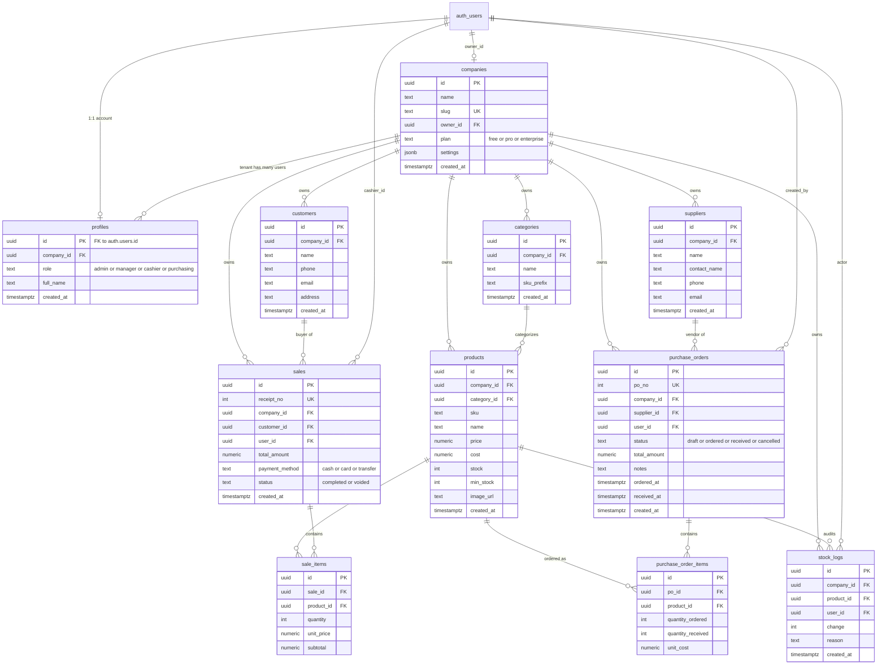

# SEA-POS Feature Specification

> This file is the living spec for sea-pos. Update it whenever a feature is added, changed, or removed.

---

## Project Overview

**SEA-POS** is a Point of Sale (POS) and ERP system targeting Southeast Asian retail, with the UI written in Thai. The system allows store operators to manage inventory, run sales transactions, handle purchasing, manage customers, and view reports.

- **Status:** Foundation + Inventory module complete; ERP modules stubbed
- **Target market:** Thailand / Southeast Asia

---

## Tech Stack

| Layer | Technology |
|-------|-----------|
| Framework | Next.js 16.2.3 (App Router) |
| UI Library | React 19.2.4 |
| Language | TypeScript 5 (strict) |
| Styling | Tailwind CSS 4 + shadcn/ui |
| Icons | lucide-react |
| Database | Supabase (PostgreSQL) |
| DB Client (browser) | `@supabase/ssr` — `createBrowserClient` |
| DB Client (server) | `@supabase/ssr` — `createServerClient` with cookies |
| Auth | Supabase Auth (email/password) |

---

## Architecture

### Rendering model
- Pages are **Server Components** by default — data is fetched on the server, no `useEffect`
- `'use client'` is used only for components that need state, event handlers, or browser APIs
- Mutations go through **Server Actions** (`'use server'`) — no direct client Supabase calls

### Auth layer
- `proxy.ts` (Next.js 16 — replaces `middleware.ts`) refreshes the Supabase session on every request
- Unauthenticated requests to any protected route are redirected to `/login`
- `app/(dashboard)/layout.tsx` performs a belt-and-suspenders auth check via `supabase.auth.getUser()`

### Data flow
```
Server Component page
  └── await createClient()          ← lib/supabase/server.ts
  └── supabase.from('table')...     ← server-side DB query
  └── <ClientComponent data={...}/> ← pass data as props

Client Component (interactive)
  └── calls Server Action            ← lib/actions/*.ts
  └── Server Action: createClient() ← lib/supabase/server.ts
  └── validates auth + mutates DB
  └── revalidatePath() / redirect()  ← triggers server re-render
```

### Environment variables
- `NEXT_PUBLIC_SUPABASE_URL` — Supabase project URL
- `NEXT_PUBLIC_SUPABASE_ANON_KEY` — Supabase anon key (safe for browser)

---

## File Structure

```
sea-pos/
├── proxy.ts                    # Next.js 16 auth proxy (session refresh + redirect)
├── types/
│   └── database.ts             # All DB row, insert, and composite types
├── lib/
│   ├── supabase/
│   │   ├── client.ts           # createBrowserClient factory (Client Components only)
│   │   └── server.ts           # createServerClient factory (Server Components + Actions)
│   ├── actions/
│   │   ├── auth.ts             # signIn, signOut
│   │   ├── inventory.ts        # adjustStock, addProduct, deleteProduct
│   │   ├── pos.ts              # createSale (stub)
│   │   ├── purchasing.ts       # createPurchaseOrder (stub)
│   │   └── customers.ts        # createCustomer (stub)
│   └── utils.ts                # cn() — clsx + tailwind-merge helper
├── components/
│   ├── ui/                     # shadcn/ui primitives
│   ├── layout/
│   │   ├── Sidebar.tsx         # Nav sidebar with active link highlighting
│   │   ├── Header.tsx          # Top bar with user email
│   │   └── DashboardShell.tsx  # Grid wrapper: sidebar + main
│   ├── auth/
│   │   └── LoginForm.tsx       # Login form using useActionState(signIn)
│   └── inventory/
│       ├── ProductTable.tsx     # shadcn Table with stock levels and badges
│       ├── StockAdjustButton.tsx # +/- buttons using useTransition + adjustStock
│       └── AddProductForm.tsx   # Add product form using useActionState(addProduct)
└── app/
    ├── layout.tsx              # Root layout (fonts, metadata)
    ├── globals.css             # Tailwind v4 + shadcn CSS variables
    ├── (auth)/
    │   ├── layout.tsx          # Centered minimal layout (no sidebar)
    │   └── login/page.tsx      # Login page
    └── (dashboard)/
        ├── layout.tsx          # Auth guard + DashboardShell
        ├── page.tsx            # redirect → /inventory
        ├── inventory/
        │   ├── page.tsx        # Stock dashboard (Server Component)
        │   └── add/page.tsx    # Add product page
        ├── pos/page.tsx        # POS (stub)
        ├── purchasing/page.tsx # Purchasing (stub)
        ├── customers/page.tsx  # Customers (stub)
        └── reports/page.tsx    # Reports (stub)
```

---

## User Roles

Role-based access control is implemented via the `profiles` table + Supabase RLS.

| Role | Thai | Access |
|------|------|--------|
| `admin` | ผู้ดูแลระบบ | Full access — all modules + user role management |
| `manager` | ผู้จัดการร้าน | Inventory, POS, Purchasing, Reports — cannot delete users |
| `cashier` | พนักงานเก็บเงิน | POS only — create sales, view products/customers |
| `purchasing` | เจ้าหน้าที่จัดซื้อ | Purchase orders + suppliers only |

Roles are set in `raw_user_meta_data` at signup and synced to `profiles` via a DB trigger (`handle_new_user`). The `get_user_role()` SQL function is used in all RLS policies.

### Test Accounts (password: `Test1234!`)

| Email | Role |
|-------|------|
| `admin@sea-pos.test` | admin |
| `manager@sea-pos.test` | manager |
| `cashier@sea-pos.test` | cashier |
| `purchasing@sea-pos.test` | purchasing |

---

## Database Schema

> All tables are defined across `supabase/001_schema.sql` through `supabase/009_multitenancy.sql`. Seed data (test accounts + sample products) is in `supabase/reset_and_demo.sql`.

### Entity-Relationship Diagram



**Conventions:**
- Every row has a `company_id` except `sale_items` and `purchase_order_items`, which inherit tenancy through their parent's `company_id` (cheaper than duplicating + enforced by RLS EXISTS joins).
- `auth_users` in the diagram is Supabase's built-in `auth.users` table (outside our `public` schema).
- Soft-foreign-keys like `stock_logs.reason` (freeform text that may reference `PO-00042` or `sale_id[:8]`) are not shown.
- Receipt numbers (`receipt_no`) come from a single sequence; PO numbers (`po_no`) from another. Both are currently company-wide; per-branch numbering is [planned for Release 2](TODO.md).


### `profiles`

| Column | Type | Notes |
|--------|------|-------|
| id | uuid | PK, FK → auth.users.id |
| role | text | `'admin'` \| `'manager'` \| `'cashier'` \| `'purchasing'` |
| full_name | text \| null | Display name |
| created_at | timestamptz | |

### `products`

| Column | Type | Notes |
|--------|------|-------|
| id | uuid | Primary key |
| sku | text | Stock-keeping unit identifier |
| name | text | Product display name |
| price | numeric(12,2) | Selling price (default 0) |
| cost | numeric(12,2) | Purchase cost (default 0) |
| stock | integer | Current stock quantity (default 0) |
| min_stock | integer | Low-stock warning threshold (default 0) |
| image_url | text \| null | Optional product image URL |
| created_at | timestamptz | Record creation time |

### `stock_logs`

| Column | Type | Notes |
|--------|------|-------|
| id | uuid | Primary key |
| product_id | uuid | FK → products.id |
| change | integer | Stock delta (positive = added, negative = removed) |
| reason | text \| null | Optional note |
| user_id | uuid \| null | FK → auth.users.id (cashier) |
| created_at | timestamptz | Log entry time |

### `customers`

| Column | Type | Notes |
|--------|------|-------|
| id | uuid | Primary key |
| name | text | |
| phone | text \| null | |
| email | text \| null | |
| address | text \| null | |
| created_at | timestamptz | |

### `suppliers`

| Column | Type | Notes |
|--------|------|-------|
| id | uuid | Primary key |
| name | text | |
| contact_name | text \| null | |
| phone | text \| null | |
| email | text \| null | |
| created_at | timestamptz | |

### `sales`

| Column | Type | Notes |
|--------|------|-------|
| id | uuid | Primary key |
| customer_id | uuid \| null | FK → customers.id (nullable for walk-in) |
| user_id | uuid | FK → auth.users.id (cashier) |
| total_amount | numeric(12,2) | |
| payment_method | text | `'cash'` \| `'card'` \| `'transfer'` |
| status | text | `'completed'` \| `'voided'` |
| created_at | timestamptz | |

### `sale_items`

| Column | Type | Notes |
|--------|------|-------|
| id | uuid | Primary key |
| sale_id | uuid | FK → sales.id ON DELETE CASCADE |
| product_id | uuid | FK → products.id |
| quantity | integer | |
| unit_price | numeric(12,2) | Price at time of sale (snapshot) |
| subtotal | numeric(12,2) | quantity × unit_price |

### `purchase_orders`

| Column | Type | Notes |
|--------|------|-------|
| id | uuid | Primary key |
| supplier_id | uuid | FK → suppliers.id |
| user_id | uuid | FK → auth.users.id |
| status | text | `'draft'` \| `'ordered'` \| `'received'` \| `'cancelled'` |
| total_amount | numeric(12,2) | |
| ordered_at | timestamptz \| null | |
| received_at | timestamptz \| null | |
| created_at | timestamptz | |

### `purchase_order_items`

| Column | Type | Notes |
|--------|------|-------|
| id | uuid | Primary key |
| po_id | uuid | FK → purchase_orders.id ON DELETE CASCADE |
| product_id | uuid | FK → products.id |
| quantity_ordered | integer | |
| quantity_received | integer | default 0 |
| unit_cost | numeric(12,2) | |

**RLS:** Fine-grained per-role policies are defined in `supabase/001_schema.sql`. See the User Roles section above for the permission matrix.

---

## Multi-tenancy (Release 1)

SEA-POS is a **B2B SaaS** — every customer is a company (tenant) with its own isolated dataset. Multiple users per company, full data separation.

### Model

| Table | Role |
|---|---|
| `companies` | One row per customer organization. Owner, plan, slug, settings jsonb. |
| `profiles.company_id` | Every user belongs to exactly one company. |
| All business tables | Have `company_id UUID NOT NULL` referencing `companies(id)`. |

### Isolation

Enforced by PostgreSQL **Row-Level Security** on every table:

```sql
USING (company_id = get_current_company_id())
WITH CHECK (company_id = get_current_company_id() AND get_user_role() IN ('...'))
```

`get_current_company_id()` is a SECURITY DEFINER function that resolves the current user's `profiles.company_id`. Even if app code forgets to filter, the database refuses cross-tenant reads and rejects cross-tenant inserts.

### Signup flow

- **Self-serve signup** — `handle_new_user` trigger creates a fresh `companies` row, the user becomes its owner with `role='admin'`.
- **Invitation** — admin includes `company_id` in the invited user's `auth.users.raw_user_meta_data`. Trigger attaches them to that company instead of creating a new one.

### Code surface

- `AuthedUser.companyId` — current user's tenant, available via [`requirePageRole` / `requireActionRole`](lib/auth.ts)
- `companyRepo` — read/update the current company (via [contracts/company.ts](lib/repositories/contracts/company.ts))
- Every other repo filters by `company_id` **transparently** via RLS — no code change needed in pages/actions

### Migration files

- [supabase/009_multitenancy.sql](supabase/009_multitenancy.sql) — adds `companies`, `company_id` columns, RLS rewrite. Backfills existing data into a `Legacy` company.
- [supabase/010_signup.sql](supabase/010_signup.sql) — `handle_new_user` reads optional `company_name` from metadata (self-serve signup).

### Pages

- **`/signup`** — self-serve onboarding. Gated by `NEXT_PUBLIC_ENABLE_SIGNUP`. When `false` (MVP1 default), returns 404; platform admin creates every company. When `true`, `handle_new_user` creates a fresh company with the user as owner.
- **`/login`** — email/password. Shows the `/signup` link only when the env flag is on.
- **`/settings/company`** — admin-only. Company name + contact info + receipt header/footer, stored in `companies.settings` jsonb.
- **`/users`** — admin creates staff. Passes `company_id` through metadata so invitees attach to the admin's tenant.

### Platform admin (invite-only MVP1 model)

- **`companies.status`** — lifecycle states: `pending`, `active`, `suspended`, `closed`. Enforced by middleware: non-active company users land on `/blocked`.
- **`profiles.is_platform_admin`** + `is_platform_admin()` SQL helper — SECURITY DEFINER function used in every RLS policy (`USING (is_platform_admin() OR company_id = get_current_company_id())`). Platform admins see and operate across all tenants.
- **Bootstrap account** — migration 011 seeds `platform@sea-pos.com` (password `PlatformAdmin1234!`). Change via SQL (see migration header comment) or grant the flag to an existing user.
- **`/platform/companies`** — list all companies with owner / user count / status.
- **`/platform/companies/new`** — platform admin creates a company + first admin user in one form. Company is created `active` (already vetted).
- **`/platform/companies/[id]`** — detail + activate/suspend/close controls.
- **`/blocked`** — dead-end page for non-active-company users (pending review / suspended / closed messages + sign out).

### Migration files for R1

- [supabase/009_multitenancy.sql](supabase/009_multitenancy.sql)
- [supabase/010_signup.sql](supabase/010_signup.sql)
- [supabase/011_platform_admin.sql](supabase/011_platform_admin.sql) — platform admin role + company.status + RLS bypass
- [supabase/012_plans_config.sql](supabase/012_plans_config.sql) — `plans` config table, `companies.plan` FK, seed 4 tiers

### Plans & limits

Plan tiers are stored in the **`plans`** table (not hardcoded), so platform admins can rename, re-price, or adjust limits without code changes.

| code | name | max_products | max_users | max_branches | monthly_price |
|---|---|---|---|---|---|
| `free` | ฟรี | 50 | 3 | 1 | ฿0 |
| `lite_pro` | โปร Lite | 300 | 10 | 2 | ฿399 |
| `standard_pro` | โปร Standard | 1,500 | 50 | 5 | ฿990 |
| `enterprise` | องค์กร | unlimited | unlimited | unlimited | Contact us |

**Enforcement** is in `lib/limits.ts`. `addProduct` and `createUser` server actions call `checkProductLimit` / `checkUserLimit` before insert; when the cap is reached they return `formatLimitError(...)` in Thai. `max_branches` is reserved for Release 2.

**Platform admin UI** at `/platform/plans` allows editing every tier inline — name, description, price, and the three limits. Leaving a limit field empty stores `NULL` meaning unlimited. A plan can be marked inactive to hide it from the picker without deleting any company references.

**Customer UI** — `/settings/company` shows live usage cards ("23 / 50 สินค้า") with progress bars turning amber at 80% and red at 100%. The admin sees a clear "ใช้เต็มแล้ว" badge long before they hit the hard error from the action.

---

## Architecture Contract

**UI never touches Supabase.** Every `.from(...)`, `.rpc(...)`, and `.auth.*` call lives in exactly one of three zones:

| Zone | Allowed |
|---|---|
| [lib/repositories/**](lib/repositories/) | All domain data access (products, customers, sales, POs, analytics, auth, users) |
| [lib/auth.ts](lib/auth.ts) | Trust anchor: reads the validated user from request headers + one `profiles` lookup |
| [proxy.ts](proxy.ts) | Middleware: validates Supabase session on every request, injects `x-sea-user-id` header |

Pages, components, and server actions go through:
- [`requirePageRole(roles)` / `requireActionRole(roles)` / `requirePage()` / `getActionUser()`](lib/auth.ts) for auth
- Repositories imported from [`@/lib/repositories`](lib/repositories/) for data

Audit command:
```bash
# Should return only lib/repositories/**, lib/auth.ts, proxy.ts
grep -rn "\.from(['\"]|\.rpc(['\"]|\.auth\." --include="*.ts" --include="*.tsx"
```

Swapping Supabase for another backend means rewriting `lib/repositories/` + `lib/auth.ts` + `proxy.ts` only. Pages and components stay untouched.

---

## Pagination & Search

All list pages use **server-side offset pagination** with URL-driven state. The convention is shared across every listing.

### URL parameters

| Param | Purpose | Default | Allowed values |
|---|---|---|---|
| `page` | 1-indexed page number | `1` | positive integer |
| `pageSize` | rows per page | `20` | `10`, `20`, `50`, `100` |
| `q` | free-text search (where supported) | none | any string |
| `status` | filter by status (PO list) | none | `draft`, `ordered`, `received`, `cancelled` |
| `category` | filter by category (inventory) | none | category UUID |

Example: `/customers?q=สมชาย&page=2&pageSize=50`

### Shared library

- [lib/pagination.ts](lib/pagination.ts): `parsePageParams`, `toSupabaseRange`, `packPaginated`, `Paginated<T>` type
- [components/ui/pagination.tsx](components/ui/pagination.tsx): reusable navigator — preserves all other query params when linking to a new page, shows row window (`1 – 20 จาก 347`), ellipsis for large page counts

### Repo pattern

Paginated methods live alongside the full-list methods (kept for POS terminal and other contexts that genuinely need all rows). Each returns `{ rows, totalCount, page, pageSize, totalPages }` in a single Supabase query (`count: 'exact'` + `.range(from, to)`).

| Repo | Paginated method | Extra filters |
|---|---|---|
| `productRepo` | `listWithCategoryPaginated` | `categoryId` |
| `customerRepo` | `listPaginated` | `search` (ILIKE across name/phone/email) |
| `supplierRepo` | `listPaginated` | — |
| `saleRepo` | `listRecentPaginated` | — |
| `purchaseOrderRepo` | `listRecentPaginated` | `status` |

### Search UX (customers)

[CustomerSearch](components/customers/CustomerSearch.tsx) debounces input by 300ms, then pushes `?q=…&page=1` via `router.push` inside `useTransition`. Each keystroke (after debounce) runs a server-side ILIKE query — escapes `%` and `_` before concatenating wildcards to prevent pattern injection. Backspacing to empty removes the `q` param entirely.

### Streaming

Each paginated table is wrapped in `<Suspense key={…}>` with a `TableSkeleton` fallback. The key includes all pagination/filter values, so page navigation + filter changes show a skeleton instead of a blank flash while the new query runs. The page shell (header, action buttons) stays static and renders instantly.

### Paginated routes

| Route | Extra params |
|---|---|
| [/inventory](app/(dashboard)/inventory/page.tsx) | `category` |
| [/customers](app/(dashboard)/customers/page.tsx) | `q` |
| [/purchasing](app/(dashboard)/purchasing/page.tsx) | `status` |
| [/purchasing/suppliers](app/(dashboard)/purchasing/suppliers/page.tsx) | — |
| [/pos/sales](app/(dashboard)/pos/sales/page.tsx) | — |

---

## Features

### Authentication

- **Purpose:** Protect all routes; only authenticated users can access the dashboard.
- **Routes/Files:** `/login` → [app/(auth)/login/page.tsx](app/(auth)/login/page.tsx), [components/auth/LoginForm.tsx](components/auth/LoginForm.tsx)
- **Behavior:** Email/password login via Supabase Auth. Session managed via HTTP-only cookies (handled by `proxy.ts` + `@supabase/ssr`). Logout via sidebar button.

### Stock Management Dashboard

- **Purpose:** Central view for monitoring and adjusting product stock levels.
- **Routes/Files:** `/inventory` → [app/(dashboard)/inventory/page.tsx](app/(dashboard)/inventory/page.tsx)
- **Behavior:**
  - Server Component fetches all products ordered by name
  - Displays name, SKU, stock, min_stock, and status badge (ปกติ / ใกล้หมด)
  - **+** / **−** buttons adjust stock by 1 via `adjustStock` Server Action
  - Each stock change updates `products.stock` and inserts a `stock_logs` row with `user_id`
  - Stock cannot go below 0 (guarded in Server Action)
  - Page re-renders automatically via `revalidatePath('/inventory')`

### Add Product

- **Purpose:** Add new products to the catalog.
- **Routes/Files:** `/inventory/add` → [app/(dashboard)/inventory/add/page.tsx](app/(dashboard)/inventory/add/page.tsx)
- **Behavior:**
  - Fields: name (required), SKU, min_stock
  - Validates name is not empty; inserts with `stock: 0`
  - On success: redirects to `/inventory`
  - Inline error display via `useActionState`

### Sales / POS *(stub)*

- **Routes/Files:** `/pos` → [app/(dashboard)/pos/page.tsx](app/(dashboard)/pos/page.tsx), [lib/actions/pos.ts](lib/actions/pos.ts)
- **Planned:** Cart UI, checkout, receipt generation, sales history

### Purchasing

- **Purpose:** Full purchase-order lifecycle — from drafting to supplier confirmation to partial goods receiving that updates stock automatically.
- **Routes/Files:**
  - `/purchasing` → [app/(dashboard)/purchasing/page.tsx](app/(dashboard)/purchasing/page.tsx) — PO list with status filter tabs
  - `/purchasing/new` → [app/(dashboard)/purchasing/new/page.tsx](app/(dashboard)/purchasing/new/page.tsx) — create draft PO
  - `/purchasing/[id]` → [app/(dashboard)/purchasing/[id]/page.tsx](app/(dashboard)/purchasing/%5Bid%5D/page.tsx) — detail, edit/confirm/cancel/receive
  - `/purchasing/suppliers` → [app/(dashboard)/purchasing/suppliers/page.tsx](app/(dashboard)/purchasing/suppliers/page.tsx) — supplier CRUD
  - Actions: [lib/actions/purchasing.ts](lib/actions/purchasing.ts) (`createPurchaseOrder`, `updatePurchaseOrder`, `confirmPurchaseOrder`, `cancelPurchaseOrder`, `receivePurchaseOrder`), [lib/actions/suppliers.ts](lib/actions/suppliers.ts) (`addSupplier`, `updateSupplier`, `deleteSupplier`)
  - Components: [POList](components/purchasing/POList.tsx), [POForm](components/purchasing/POForm.tsx), [POLineEditor](components/purchasing/POLineEditor.tsx), [POActions](components/purchasing/POActions.tsx), [ReceiveForm](components/purchasing/ReceiveForm.tsx), [SupplierTable](components/purchasing/SupplierTable.tsx), [SupplierForm](components/purchasing/SupplierForm.tsx)
  - Helpers: [lib/po.ts](lib/po.ts) (`formatPoNo`, status labels/variants)
- **Roles:** admin, manager, purchasing for all operations; only admin can delete suppliers.
- **Status machine:** `draft → ordered → received`, plus `draft|ordered → cancelled`. Status transitions are enforced server-side in each action.
- **Document numbering:** `purchase_orders.po_no` is an auto-incremented `INTEGER` via `po_number_seq`, formatted `PO-00001` in the UI (same pattern as `receipt_no`).
- **Receiving flow (partial):** on an `ordered` PO, [ReceiveForm](components/purchasing/ReceiveForm.tsx) lets the user enter a qty per line (≤ remaining). On submit, the action calls the SECURITY DEFINER RPC `receive_po_item(item_id, qty, user_id)` which: (1) locks the PO line, (2) validates qty against outstanding, (3) increments `products.stock`, (4) updates `quantity_received`, (5) writes a `stock_logs` row (`รับของจาก PO-XXXXX`), (6) auto-flips PO status to `received` and stamps `received_at` when every line is complete.
- **Why SECURITY DEFINER:** the purchasing role is not allowed to UPDATE `products` directly via RLS — the RPC bypasses this safely with validated inputs, mirroring the `decrement_stock` pattern used by POS.
- **Schema migration:** [supabase/006_purchasing.sql](supabase/006_purchasing.sql) adds `po_number_seq`, `purchase_orders.po_no`, `purchase_orders.notes`, the `receive_po_item` function, and a `purchase_order_items_delete` RLS policy (needed so drafts can be re-edited by replacing their line items).

### Customers

- **Purpose:** CRM module — manage customer profiles, view per-customer purchase history, and attach a customer to a sale at checkout.
- **Routes/Files:**
  - `/customers` → [app/(dashboard)/customers/page.tsx](app/(dashboard)/customers/page.tsx)
  - `/customers/[id]` → [app/(dashboard)/customers/[id]/page.tsx](app/(dashboard)/customers/[id]/page.tsx)
  - [components/customers/CustomerTable.tsx](components/customers/CustomerTable.tsx), [CustomerForm.tsx](components/customers/CustomerForm.tsx), [CustomerPicker.tsx](components/customers/CustomerPicker.tsx), [CustomerDeleteButton.tsx](components/customers/CustomerDeleteButton.tsx)
  - [lib/actions/customers.ts](lib/actions/customers.ts): `addCustomer`, `updateCustomer`, `deleteCustomer`, `quickCreateCustomer`
- **Roles:** admin, manager, cashier can view and add; admin and manager can edit; only admin can delete.
- **List page behavior:**
  - Server Component aggregates completed sales per customer (count, total spent, last purchase)
  - Client-side search on name / phone / email
  - Inline "เพิ่มลูกค้า" form (managers only)
  - Clicking a row opens detail page
- **Detail page:** profile form + stats cards (order count, total spent, average per order) + full purchase history table linking to each receipt. Delete is blocked if the customer has any sales (hard-delete guard preserves history).
- **POS integration:** [CustomerPicker](components/customers/CustomerPicker.tsx) is rendered above the payment-method selector in [POSTerminal](components/pos/POSTerminal.tsx). Cashiers can search existing customers or quick-create a new one inline via `quickCreateCustomer`. Selected `customer_id` is submitted as a hidden field; `walk-in` leaves it null.

### Reports *(stub)*

- **Routes/Files:** `/reports` → [app/(dashboard)/reports/page.tsx](app/(dashboard)/reports/page.tsx)
- **Planned:** Sales summaries, stock movement history (from stock_logs), low-stock report

### User Management *(admin only)*

- **Purpose:** Allow admins to create, edit, delete, and reset passwords for application users.
- **Routes/Files:**
  - `/users` → [app/(dashboard)/users/page.tsx](app/(dashboard)/users/page.tsx)
  - [components/users/AddUserForm.tsx](components/users/AddUserForm.tsx), [components/users/UserTable.tsx](components/users/UserTable.tsx)
  - [lib/actions/users.ts](lib/actions/users.ts), [lib/supabase/admin.ts](lib/supabase/admin.ts)
- **Behavior:**
  - Page redirects non-admin users to `/`
  - Lists all users (email, full_name, role) via `supabase.auth.admin.listUsers()` merged with `profiles`
  - **Add user:** inline form creates an auth user with `email_confirm: true` and upserts their profile
  - **Edit user:** inline row editor updates `profiles.full_name` and `profiles.role`
  - **Reset password:** inline row form sets a new password (min 8 chars)
  - **Delete user:** confirmation prompt then `auth.admin.deleteUser()`; cannot delete own account
  - All mutations run on the server with a service-role client that bypasses RLS — the client is never exposed to the browser
- **Constraints:** Requires `SUPABASE_SERVICE_ROLE_KEY` in `.env`. Role is always validated against the `UserRole` union.
