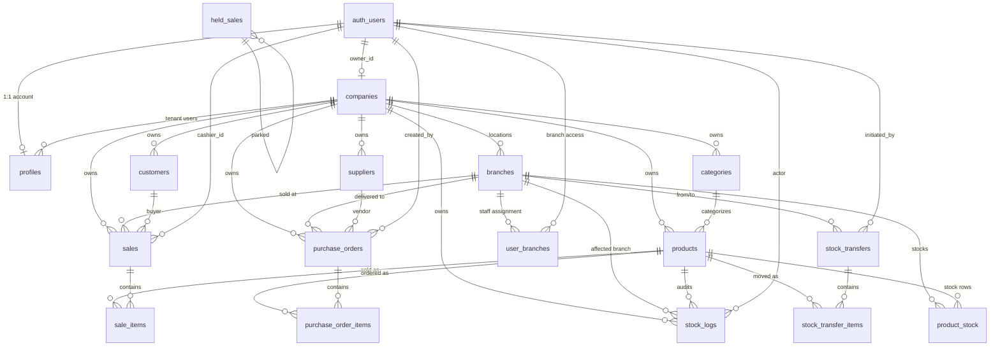

# SEA-POS Feature Specification

> Living spec for sea-pos. Update whenever a feature is added, changed, or removed.

---

## Project Overview

**SEA-POS** is a multi-tenant Point of Sale (POS) and ERP system for Southeast Asian retail, with the UI written in Thai. Operators manage inventory, run POS transactions, handle purchasing, manage customers, and view reports — all behind a multi-branch, role-gated auth layer.

- **Status:** Full-stack SaaS — all core modules live (POS, Inventory, Purchasing, Customers, Reports, Users, Branches, Platform Admin)
- **Target market:** Thailand / Southeast Asia

---

## Tech Stack

| Layer | Technology |
|-------|-----------|
| Framework | Next.js 16.2.3 (App Router) |
| UI Library | React 19.2.4 |
| Language | TypeScript 5 (strict) |
| Styling | Tailwind CSS 4 + shadcn/ui |
| Icons | lucide-react |
| Database | Supabase (PostgreSQL) |
| DB Client (browser) | `@supabase/ssr` — `createBrowserClient` |
| DB Client (server) | `@supabase/ssr` — `createServerClient` with cookies |
| Auth | Supabase Auth (email/password) |
| Decimal math | decimal.js via `lib/money.ts` |

---

## Architecture

### Rendering model
- Pages are **Server Components** by default — data is fetched on the server, no `useEffect`
- `'use client'` is used only for components that need state, event handlers, or browser APIs
- Mutations go through **Server Actions** (`'use server'`) — no direct client Supabase calls

### Auth layer
- `proxy.ts` (Next.js 16 — replaces `middleware.ts`) refreshes the Supabase session on every request and injects `x-sea-user-id` / `x-sea-branch` headers
- Unauthenticated requests to any protected route are redirected to `/login`
- `app/(dashboard)/layout.tsx` performs a belt-and-suspenders auth check via `supabase.auth.getUser()`
- Non-active-company users (pending / suspended / closed) land on `/blocked`

### Architecture contract

**UI never touches Supabase.** Every `.from(...)`, `.rpc(...)`, and `.auth.*` call lives in exactly one of three zones:

| Zone | Allowed |
|---|---|
| `lib/repositories/**` | All domain data access |
| `lib/auth.ts` | Trust anchor: reads validated user + one `profiles` lookup |
| `proxy.ts` | Middleware: validates Supabase session, injects headers |

Pages, components, and server actions go through `requirePageRole` / `requireActionRole` / `getActionUser` (from `lib/auth.ts`) and repositories from `lib/repositories/`.

Swapping Supabase for another backend means rewriting `lib/repositories/` + `lib/auth.ts` + `proxy.ts` only.

### Data flow
```
Server Component page
  └── requirePageRole(roles)             ← lib/auth.ts
  └── repo.list(...)                     ← lib/repositories/supabase/*.ts
  └── <ClientComponent data={...}/>      ← pass data as props

Client Component (interactive)
  └── calls Server Action                ← lib/actions/*.ts
  └── Server Action: requireActionRole() ← lib/auth.ts
  └── repo.insert / update / rpc(...)   ← lib/repositories/supabase/*.ts
  └── revalidatePath() / redirect()      ← triggers server re-render
```

### Environment variables
- `NEXT_PUBLIC_SUPABASE_URL` — Supabase project URL
- `NEXT_PUBLIC_SUPABASE_ANON_KEY` — Supabase anon key (safe for browser)
- `SUPABASE_SERVICE_ROLE_KEY` — service-role key (server only, never exposed to browser)
- `NEXT_PUBLIC_ENABLE_SIGNUP` — `"true"` enables self-serve signup page (default `"false"`)

---

## File Structure

```
sea-pos/
├── proxy.ts                          # Next.js 16 auth proxy (session refresh + redirects)
├── types/
│   └── database.ts                   # All DB row, insert, and composite types
├── lib/
│   ├── supabase/
│   │   ├── client.ts                 # createBrowserClient (Client Components only)
│   │   ├── server.ts                 # createServerClient (Server Components + Actions)
│   │   └── admin.ts                  # Service-role client (users admin actions only)
│   ├── auth.ts                       # requirePageRole, requireActionRole, getActionUser
│   ├── branch-filter.ts              # Resolves effective branchId per caller + URL param
│   ├── vat.ts                        # getVatConfig, computeVat, computePoBreakdown
│   ├── money.ts                      # Decimal.js wrappers (add, mul, lineTotal, moneyStr…)
│   ├── pagination.ts                 # parsePageParams, toSupabaseRange, packPaginated
│   ├── format.ts                     # formatBaht, formatReceiptNo, formatPoNo
│   ├── po.ts                         # formatPoNo, PO status labels/variants
│   ├── labels.ts                     # ROLE_LABELS, ROLE_BADGE_VARIANT
│   ├── daterange.ts                  # parseDateRange, local-TZ ISO helpers
│   ├── limits.ts                     # checkProductLimit, checkUserLimit, formatLimitError
│   ├── utils.ts                      # cn() — clsx + tailwind-merge helper
│   ├── actions/
│   │   ├── auth.ts                   # signIn, signUp, signOut
│   │   ├── inventory.ts              # addProduct, updateProduct, deleteProduct, adjustStock, quickCreateProduct
│   │   ├── pos.ts                    # createSale, voidSale, searchInStockProducts, findProductByCode
│   │   ├── purchasing.ts             # createPurchaseOrder, updatePurchaseOrder, confirmPurchaseOrder, cancelPurchaseOrder, receivePurchaseOrder
│   │   ├── customers.ts              # addCustomer, updateCustomer, deleteCustomer, quickCreateCustomer
│   │   ├── suppliers.ts              # addSupplier, updateSupplier, deleteSupplier
│   │   ├── categories.ts             # addCategory, updateCategoryPrefix, updateCategoryVatExempt, deleteCategory
│   │   ├── stockTransfers.ts         # createStockTransfer, receiveStockTransfer, cancelStockTransfer
│   │   ├── heldSales.ts              # holdSale, listHeldSales, resumeHeldSale, deleteHeldSale
│   │   ├── users.ts                  # createUser, updateUser, resetUserPassword, forceSignOutUser, updateUserBranches, deleteUser
│   │   ├── branches.ts               # createBranch, updateBranch, setBranchDefault, deleteBranch, setActiveBranch
│   │   ├── company.ts                # updateCompanySettings
│   │   ├── storage.ts                # uploadProductImage, removeProductImage, uploadCompanyAsset, removeCompanyAsset, createDownloadUrl
│   │   ├── platform.ts               # createCompany, setCompanyStatus, setCompanyPlan
│   │   └── plans.ts                  # updatePlan
│   └── repositories/
│       ├── contracts/                # TypeScript interfaces for every repo
│       └── supabase/                 # Supabase implementations
│           └── analytics.ts          # Revenue, stock value, VAT summary queries
├── components/
│   ├── ui/                           # shadcn/ui primitives (badge, button, card, dialog, input, label, native-select, page-size-picker, pagination, separator, skeleton, table)
│   ├── layout/
│   │   ├── Sidebar.tsx               # Nav sidebar — grouped sections, active link, full-row logout
│   │   ├── Header.tsx                # Top bar — branch picker + user display
│   │   ├── DashboardShell.tsx        # Grid wrapper: sidebar + main
│   │   ├── BranchPicker.tsx          # Branch switcher cookie action
│   │   └── BranchScopeToggle.tsx     # "สาขาของฉัน / ทุกสาขา" segment control (admin only)
│   ├── auth/
│   │   └── LoginForm.tsx             # Login form (useActionState + signIn)
│   ├── dashboard/
│   │   ├── KpiCard.tsx               # Today KPI metric card
│   │   ├── RevenueTrendChart.tsx     # 7-day revenue bar chart
│   │   ├── TopProductsBar.tsx        # Top selling products horizontal bar
│   │   ├── PaymentMixDonut.tsx       # Payment method donut chart
│   │   ├── RecentSalesList.tsx       # Latest sales mini-list
│   │   └── LowStockList.tsx          # Low-stock alert list
│   ├── inventory/
│   │   ├── AddProductForm.tsx        # Add product (useActionState + addProduct)
│   │   ├── EditProductForm.tsx       # Edit product (useActionState + updateProduct)
│   │   ├── ProductTable.tsx          # Product list with stock, badges, adjust buttons
│   │   ├── ProductThumb.tsx          # Product image thumbnail with upload shortcut
│   │   ├── ProductImageUpload.tsx    # Image upload / remove (Supabase Storage)
│   │   ├── StockAdjustButton.tsx     # +/- stock buttons (useTransition + adjustStock)
│   │   ├── AddCategoryForm.tsx       # Inline add category form
│   │   ├── CategoryRow.tsx           # Editable category row (prefix, VAT exempt)
│   │   ├── TransferCreateForm.tsx    # New stock transfer form
│   │   ├── TransferLineEditor.tsx    # Per-product line qty inputs
│   │   ├── TransferReceiveForm.tsx   # Receive/partial-receive form
│   │   └── TransferActions.tsx       # Cancel / status action buttons
│   ├── customers/
│   │   ├── CustomerTable.tsx         # Paginated customer list
│   │   ├── CustomerForm.tsx          # Add / edit customer inline form
│   │   ├── CustomerSearch.tsx        # Debounced search with URL state
│   │   ├── CustomerPicker.tsx        # POS customer selector + quick-create
│   │   └── CustomerDeleteButton.tsx  # Delete with guard (no sales)
│   ├── pos/
│   │   ├── POSTerminal.tsx           # Main POS UI — product grid, cart, checkout
│   │   ├── HeldSalesDrawer.tsx       # "บิลที่พักไว้" slide-in list
│   │   ├── ProductDetailDialog.tsx   # Product info dialog from grid
│   │   ├── PrintButton.tsx           # Receipt print trigger
│   │   └── VoidSaleForm.tsx          # Void sale confirmation form
│   ├── purchasing/
│   │   ├── POList.tsx                # Purchase order list rows
│   │   ├── POForm.tsx                # Create / edit PO form
│   │   ├── POLineEditor.tsx          # Line-item editor with live net/VAT/gross
│   │   ├── POActions.tsx             # Confirm / cancel action buttons
│   │   ├── ReceiveForm.tsx           # Partial-receive qty inputs
│   │   ├── SupplierTable.tsx         # Supplier list (edit inline)
│   │   └── SupplierForm.tsx          # Add / edit supplier form
│   ├── reports/
│   │   ├── DateRangePicker.tsx       # Preset + custom date range with segment control
│   │   └── ExportButton.tsx          # CSV download trigger
│   ├── settings/
│   │   ├── CompanySettingsForm.tsx   # Company name, VAT config, receipt header/footer
│   │   ├── CompanyLogoUpload.tsx     # Logo upload / remove
│   │   ├── AddBranchDialog.tsx       # New branch dialog
│   │   ├── BranchRow.tsx             # Inline branch edit row
│   │   └── UsageCard.tsx             # Plan limits usage bar (products, users, branches)
│   ├── users/
│   │   ├── AddUserForm.tsx           # Create staff user inline form
│   │   ├── UserTable.tsx             # User list with edit / reset / delete
│   │   └── BranchMultiSelect.tsx     # Multi-branch assignment with default star
│   ├── platform/
│   │   ├── CreateCompanyForm.tsx     # Platform admin creates company + first user
│   │   ├── CompanyStatusControls.tsx # Activate / suspend / close controls
│   │   ├── CompanyPlanControls.tsx   # Change company plan picker
│   │   └── PlanEditor.tsx            # Edit plan tier inline
│   └── loading/
│       ├── PageSkeleton.tsx          # Full-page loading skeleton
│       ├── TableSkeleton.tsx         # Table row skeletons
│       ├── FormSkeleton.tsx          # Form field skeletons
│       └── DetailSkeleton.tsx        # Detail page skeleton
└── app/
    ├── layout.tsx                    # Root layout (fonts, metadata)
    ├── globals.css                   # Tailwind v4 + Apple HIG CSS variables
    ├── (auth)/
    │   ├── layout.tsx                # Centered auth layout (no sidebar)
    │   ├── login/page.tsx            # Login page
    │   ├── signup/page.tsx           # Self-serve signup (gated by NEXT_PUBLIC_ENABLE_SIGNUP)
    │   └── blocked/page.tsx          # Dead-end for non-active-company users
    └── (dashboard)/
        ├── layout.tsx                # Auth guard + DashboardShell
        ├── loading.tsx               # Global loading skeleton
        ├── page.tsx                  # redirect → /dashboard
        ├── dashboard/page.tsx        # KPI overview, charts, low-stock, recent sales
        ├── no-branch/page.tsx        # Fallback for users with zero branch assignments
        ├── inventory/
        │   ├── page.tsx              # Product list with pagination + category filter
        │   ├── add/page.tsx          # Add product page
        │   ├── [id]/edit/page.tsx    # Edit product page
        │   ├── categories/page.tsx   # Category management (SKU prefix, VAT exempt)
        │   ├── transfers/page.tsx    # Stock transfer list
        │   ├── transfers/new/page.tsx # Create transfer
        │   └── transfers/[id]/page.tsx # Transfer detail + receive/cancel
        ├── pos/
        │   ├── page.tsx              # POS terminal (cashier)
        │   ├── sales/page.tsx        # Sales history list
        │   └── receipt/[saleId]/page.tsx # Printable receipt
        ├── purchasing/
        │   ├── page.tsx              # PO list with status tabs
        │   ├── new/page.tsx          # Create draft PO
        │   ├── [id]/page.tsx         # PO detail + edit / confirm / receive / cancel
        │   └── suppliers/page.tsx    # Supplier CRUD
        ├── customers/
        │   ├── page.tsx              # Customer list + search
        │   └── [id]/page.tsx         # Customer detail + history
        ├── reports/page.tsx          # Sales + inventory + VAT reports + CSV export
        ├── users/page.tsx            # User management (admin only)
        ├── settings/
        │   ├── company/page.tsx      # Company settings + logo + VAT config
        │   └── branches/page.tsx     # Branch management
        └── platform/
            ├── companies/page.tsx    # All companies list (platform admin)
            ├── companies/new/page.tsx # Create company + first user
            ├── companies/[id]/page.tsx # Company detail + status / plan controls
            └── plans/page.tsx        # Subscription plan tier editor
    └── api/
        └── reports/export/route.ts  # GET: CSV export (sales, stock-movements, inventory, vat)
```

---

## User Roles

Role-based access control is implemented via the `profiles` table + Supabase RLS.

| Role | Thai | Access |
|------|------|--------|
| `admin` | ผู้ดูแลระบบ | Full access — all modules + user / branch management |
| `manager` | ผู้จัดการร้าน | Inventory, POS, Purchasing, Customers, Reports — cannot manage users |
| `cashier` | พนักงานเก็บเงิน | POS only — create sales, view products / customers |
| `purchasing` | เจ้าหน้าที่จัดซื้อ | Purchase orders + suppliers + inventory view |

Roles are set in `raw_user_meta_data` at signup and synced to `profiles` via the `handle_new_user` DB trigger. `get_user_role()` SQL function is used in all RLS policies.

### Test Accounts (password: `Test1234!`)

| Email | Role |
|-------|------|
| `admin@sea-pos.test` | admin |
| `manager@sea-pos.test` | manager |
| `cashier@sea-pos.test` | cashier |
| `purchasing@sea-pos.test` | purchasing |

Platform admin: `platform@sea-pos.com` / `PlatformAdmin1234!`

---

## Database Schema

> Migrations live in `supabase/001_schema.sql` → `supabase/023_track_stock.sql`. Demo data in `supabase/reset_and_demo.sql`.

### Migration Log

| File | Purpose |
|------|---------|
| `001_schema.sql` | Core tables: profiles, products, customers, suppliers, sales, sale_items, stock_logs |
| `002_seed.sql` | Demo accounts + sample products |
| `003_functions.sql` | DB functions: role checks, receipt generators |
| `004_receipt_number.sql` | Sequential per-branch receipt numbering |
| `005_categories.sql` | `categories` table with `sku_prefix` |
| `006_purchasing.sql` | `purchase_orders`, `purchase_order_items`, `po_number_seq`, `receive_po_item` RPC |
| `007_purchasing_new_product.sql` | Allow `purchasing` role to create products |
| `008_sku_prefix.sql` | Auto-generate SKU from category prefix |
| `009_multitenancy.sql` | `companies` table, `company_id` columns, RLS rewrite, multi-tenant isolation |
| `010_signup.sql` | `handle_new_user` trigger — self-serve company creation |
| `011_platform_admin.sql` | `is_platform_admin`, `companies.status`, RLS bypass for platform admin |
| `012_plans_config.sql` | `plans` config table, `companies.plan` FK, seed 4 tiers |
| `013_storage.sql` | Supabase Storage buckets + RLS policies |
| `014_multi_branch.sql` | `branches`, `product_stock` pivot, `user_branches`, per-branch receipt numbering |
| `015_stock_transfers.sql` | `stock_transfers`, `stock_transfer_items`, send/receive/cancel RPCs |
| `016_transfer_partial_receive.sql` | Partial-receive support + discrepancy notes |
| `017_branch_rls.sql` | Tighten sales/POs/stock_logs to branch scope; admin bypass |
| `018_vat.sql` | `categories.vat_exempt`, `products.vat_exempt`, `sales.subtotal_ex_vat + vat_amount`, company VAT settings |
| `019_purchase_vat.sql` | `purchase_orders.subtotal_ex_vat + vat_amount` — input VAT (ภาษีซื้อ) |
| `020_product_barcode.sql` | `products.barcode` + unique partial index per company |
| `021_held_sales.sql` | `held_sales` table (พักบิล) + branch-aware RLS |
| `022_indexes.sql` | Performance indexes |
| `023_track_stock.sql` | `products.track_stock BOOLEAN NOT NULL DEFAULT true` |

### Entity-Relationship Diagram



### Key Tables

#### `companies`
| Column | Type | Notes |
|--------|------|-------|
| id | uuid | PK |
| name | text | |
| slug | text | UNIQUE |
| owner_id | uuid | FK → auth.users |
| plan | text | `free` \| `lite_pro` \| `standard_pro` \| `enterprise` |
| status | text | `pending` \| `active` \| `suspended` \| `closed` |
| settings | jsonb | `{ vatMode, vatRate, receiptHeader, receiptFooter, … }` |

#### `profiles`
| Column | Type | Notes |
|--------|------|-------|
| id | uuid | PK, FK → auth.users.id |
| company_id | uuid | FK → companies.id |
| role | text | `admin` \| `manager` \| `cashier` \| `purchasing` |
| full_name | text \| null | |
| is_platform_admin | boolean | Platform-wide bypass flag |

#### `products`
| Column | Type | Notes |
|--------|------|-------|
| id | uuid | PK |
| company_id | uuid | FK |
| category_id | uuid \| null | FK |
| sku | text \| null | Internal stock code |
| barcode | text \| null | Printed EAN/UPC — unique per company |
| name | text | |
| price | numeric(12,2) | Selling price |
| cost | numeric(12,2) | Purchase cost |
| min_stock | integer | Low-stock threshold |
| track_stock | boolean | `true` = normal gate; `false` = always available (food/service) |
| vat_exempt | boolean | Product-level VAT override |
| image_url | text \| null | |

> Stock lives in `product_stock` (per-branch pivot) — not on `products`.

#### `product_stock`
PK `(product_id, branch_id)`. One row per product/branch.

| Column | Type | Notes |
|--------|------|-------|
| product_id | uuid | FK |
| branch_id | uuid | FK |
| company_id | uuid | FK |
| quantity | integer | `>= 0` CHECK |

#### `branches`
| Column | Type | Notes |
|--------|------|-------|
| id | uuid | PK |
| company_id | uuid | FK |
| code | text | Receipt prefix (e.g. `B01`) — `UNIQUE (company_id, code)` |
| name | text | |
| address, phone, tax_id | text \| null | Printed on receipt |
| is_default | boolean | Exactly one `true` per company |

#### `user_branches`
PK `(user_id, branch_id)`.

| Column | Type | Notes |
|--------|------|-------|
| user_id | uuid | FK → auth.users |
| branch_id | uuid | FK |
| is_default | boolean | One default per user → initial `activeBranchId` |

#### `sales`
| Column | Type | Notes |
|--------|------|-------|
| id | uuid | PK |
| receipt_no | integer | Per-branch counter — `UNIQUE (branch_id, receipt_no)` |
| company_id, branch_id | uuid | FK |
| customer_id | uuid \| null | Walk-in = null |
| user_id | uuid | Cashier FK |
| total_amount | numeric(12,2) | Gross total |
| subtotal_ex_vat | numeric(12,2) | Net pre-VAT |
| vat_amount | numeric(12,2) | 0 for mode=none or exempt-only carts |
| payment_method | text | `cash` \| `card` \| `transfer` |
| status | text | `completed` \| `voided` |

#### `sale_items`
| Column | Type | Notes |
|--------|------|-------|
| id | uuid | PK |
| sale_id | uuid | FK ON DELETE CASCADE |
| product_id | uuid | FK |
| quantity | integer | |
| unit_price | numeric(12,2) | Price snapshot at time of sale |
| subtotal | numeric(12,2) | quantity × unit_price |

#### `purchase_orders`
| Column | Type | Notes |
|--------|------|-------|
| id | uuid | PK |
| po_no | integer | Company-wide counter |
| company_id, branch_id | uuid | FK |
| supplier_id, user_id | uuid | FK |
| status | text | `draft` \| `ordered` \| `received` \| `cancelled` |
| total_amount | numeric(12,2) | Gross paid |
| subtotal_ex_vat | numeric(12,2) | Net (ภาษีซื้อ base) |
| vat_amount | numeric(12,2) | Input VAT |
| ordered_at, received_at | timestamptz \| null | |

#### `stock_logs`
| Column | Type | Notes |
|--------|------|-------|
| id | uuid | PK |
| company_id, branch_id, product_id, user_id | uuid | FK |
| change | integer | Delta (positive = added) |
| reason | text \| null | e.g. `'ขาย #<id>'`, `'รับของจาก PO-00042'`, `'โอนออก #<id>'` |

Ledger invariant: `Σ stock_logs.change == product_stock.quantity` per `(product, branch)`.

#### `held_sales`
| Column | Type | Notes |
|--------|------|-------|
| id | uuid | PK |
| company_id, branch_id | uuid | FK |
| user_id | uuid | Cashier who parked it |
| customer_id | uuid \| null | |
| items | jsonb | `[{ productId, name, price, quantity, vatExempt }]` |
| note | text \| null | e.g. "คุณสมชาย", "โต๊ะ 3" |

#### `stock_transfers` / `stock_transfer_items`
| Column | Notes |
|--------|-------|
| `status` | `draft` → `in_transit` → `received` \| `cancelled` |
| `quantity_received` | `0..quantity_sent` — populated on receive |
| `receive_note` | Discrepancy note when received < sent (NOT in stock_logs) |

**RLS:** company-scoped baseline from `009_multitenancy.sql`, branch-tightened in `017_branch_rls.sql`. `is_company_admin()` and `is_platform_admin()` bypass the branch check for cross-branch reporting.

---

## Multi-tenancy

SEA-POS is a **B2B SaaS** — every customer is a company (tenant) with its own isolated dataset.

### Isolation

Enforced by PostgreSQL RLS on every table:

```sql
USING (company_id = get_current_company_id())
WITH CHECK (company_id = get_current_company_id() AND get_user_role() IN ('...'))
```

`get_current_company_id()` is a SECURITY DEFINER function that resolves the caller's `profiles.company_id`. Cross-tenant reads and inserts are impossible even if app code forgets to filter.

### Signup flow

- **Self-serve** (`NEXT_PUBLIC_ENABLE_SIGNUP=true`) — `handle_new_user` trigger creates a fresh `companies` row, user becomes owner with `role='admin'`.
- **Invitation** — admin passes `company_id` in `raw_user_meta_data`; trigger attaches the user to that company.
- **Platform admin** — `/platform/companies/new` creates company + first admin user in one form; company starts `active`.

### Company status lifecycle

`pending → active`, `active → suspended / closed`. Non-active users land on `/blocked`. Enforced in `proxy.ts`.

### Plans & limits

Plan tiers stored in the **`plans`** table (not hardcoded).

| code | name | max_products | max_users | max_branches | monthly_price |
|---|---|---|---|---|---|
| `free` | ฟรี | 50 | 3 | 1 | ฿0 |
| `lite_pro` | โปร Lite | 300 | 10 | 2 | ฿399 |
| `standard_pro` | โปร Standard | 1,500 | 50 | 5 | ฿990 |
| `enterprise` | องค์กร | unlimited | unlimited | unlimited | Contact us |

Enforcement in `lib/limits.ts`: `addProduct` and `createUser` call `checkProductLimit` / `checkUserLimit` before insert.

**Customer UI:** `/settings/company` shows live usage cards with progress bars (amber at 80%, red at 100%).

**Platform admin UI:** `/platform/plans` — edit name, description, price, and limits inline.

---

## Money & Decimal Precision

All monetary arithmetic **must** go through `lib/money.ts` (wraps decimal.js with `ROUND_HALF_UP`, 2 decimal places).

**Why:** IEEE-754 floats produce silent drift — `0.1 + 0.2 = 0.30000000000000004`. At 7% VAT this compounds into mis-filed ภ.พ.30 returns.

**Rule:** never write `a + b`, `price * qty`, `/`, or `.toFixed(2)` on money values. Use `add`, `lineTotal`, `div`, `moneyStr`. Counts and pagination math stay plain `number`.

---

## VAT

Three-level model. Company sets the mode in `/settings/company`:
- `none` — VAT disabled everywhere
- `excluded` — VAT added on top of listed prices at checkout
- `included` — listed prices are gross; VAT broken out for reporting

Per-category exemption at `/inventory/categories`; per-product override in Add/Edit Product form.

**Effective exemption per line** = `product.vat_exempt OR category.vat_exempt`.

`createSale` re-resolves exemptions server-side via `productRepo.vatExemptMap(ids)` — client-supplied flags are not trusted.

**Purchase side (ภาษีซื้อ):** `createPurchaseOrder` / `updatePurchaseOrder` mirror the same pattern. Draft POs auto-recompute on detail-page read if company VAT config has drifted; ordered/received/cancelled POs stay frozen for audit.

**VAT Report** (visible only when `vat_mode ≠ 'none'`):
- Output: completed sales — net, VAT, gross, bill counts
- Input: `received` POs — net, input VAT, gross, PO counts
- Net liability: `vatOutput − vatInput` — negative = carry-forward / refund claim

CSV export `kind=vat` produces OUTPUT rows, INPUT rows, and a final `NET VAT_PAYABLE` row — ready for ภ.พ.30 prep.

---

## Pagination & Search

All list pages use **server-side offset pagination** with URL-driven state.

### URL parameters

| Param | Purpose | Default |
|---|---|---|
| `page` | 1-indexed page number | `1` |
| `pageSize` | rows per page | `20` (options: 10, 20, 50, 100) |
| `q` | free-text search | — |
| `status` | filter by status (PO list) | — |
| `category` | category UUID filter (inventory) | — |

### Shared library

- `lib/pagination.ts`: `parsePageParams`, `toSupabaseRange`, `packPaginated`, `Paginated<T>`
- `components/ui/pagination.tsx`: navigator — preserves all query params, shows row window, ellipsis for large counts

Each paginated table is wrapped in `<Suspense key={…}>` with `TableSkeleton` fallback. The key includes all filter values so navigation shows a skeleton instead of a blank flash.

| Route | Search / filter |
|---|---|
| `/inventory` | `category` UUID |
| `/customers` | `q` (ILIKE name/phone/email) |
| `/purchasing` | `status` tab |
| `/purchasing/suppliers` | — |
| `/pos/sales` | — |

---

## Features

### Authentication

- **Routes:** `/login`, `/signup` (when env flag on), `/blocked`
- **Files:** `app/(auth)/login/page.tsx`, `components/auth/LoginForm.tsx`, `lib/actions/auth.ts`
- Email/password via Supabase Auth. Session via HTTP-only cookies managed by `proxy.ts`. Full-row logout button in sidebar.

### Dashboard

- **Route:** `/dashboard`
- **Roles:** admin, manager
- Today KPI cards (revenue, orders, average order, low-stock count), 7-day revenue trend chart, top products, payment mix donut, recent sales list, low-stock alert list. All branch-scoped; admin sees the BranchScopeToggle.

### Inventory / Stock Management

- **Routes:** `/inventory`, `/inventory/add`, `/inventory/[id]/edit`, `/inventory/categories`
- **Roles:** admin, manager, purchasing (view + adjust); cashier (no access)
- Product list with pagination + category filter tab. Low-stock badges. +/− stock adjust buttons (Server Action). Admin/manager see pencil edit link. Image upload per product. Category management with SKU prefix and VAT exempt flag.

#### Track Stock (`products.track_stock`)

- `true` (default) — normal stock gate; only shown in POS when `quantity > 0`; sale decrements stock
- `false` — always shown in POS with ∞ badge; `createSale` skips decrement; inventory shows `—` for stock columns
- `addProduct` skips `productStockRepo.seed` when `track_stock = false`
- POS query uses two parallel Supabase queries (tracked INNER JOIN + untracked LEFT JOIN), merged in-memory

#### Edit Product

- **Route:** `/inventory/[id]/edit`
- **Roles:** admin, manager
- Fields: name, SKU, barcode, category, price, cost, min_stock, track_stock, vat_exempt. Switching untracked → tracked seeds a `product_stock` row.

#### Stock Transfers

- **Routes:** `/inventory/transfers`, `/inventory/transfers/new`, `/inventory/transfers/[id]`
- **Roles:** admin, manager, purchasing
- Lifecycle: `draft → in_transit → received | cancelled`. Create immediately calls `send_stock_transfer` RPC (atomic stock deduct + logs at source branch). Receive supports partial quantities + discrepancy notes on `stock_transfer_items.receive_note` (not stock_logs — preserves ledger).

### POS (Point of Sale)

- **Routes:** `/pos`, `/pos/sales`, `/pos/receipt/[saleId]`
- **Roles:** admin, manager, cashier
- Touch-friendly product grid (paginated, branch-scoped), cart with line totals, customer picker, payment method selector, checkout.
- **Barcode/SKU scan:** Enter key commits scan — `findProductByCode` matches `barcode` exactly first, falls back to case-insensitive SKU. Native `<input>` (not shadcn wrapper) so Enter isn't consumed by Radix. Auto-focus on mount + after each add.
- **Stock flow:** `createSale` calls `decrement_stock` RPC per line — SECURITY DEFINER, locks `product_stock` row, validates qty, decrements, writes `stock_logs` row (`'ขาย #<id>'`). Void reverses via `productStockRepo.adjust` (`'ยกเลิกออเดอร์ #...'`).
- **Receipt:** per-branch header block (`branch.code-padded`, e.g. `B01-00042`), VAT breakdown shown when `vat_amount > 0`.
- **Money:** every line subtotal, cart total, and VAT computation via `lib/money.ts`.

#### Held Sales (พักบิล)

- **Files:** `components/pos/HeldSalesDrawer.tsx`, `lib/actions/heldSales.ts`, `supabase/021_held_sales.sql`
- **Roles:** admin, manager, cashier
- Park an in-progress cart to serve the next customer; resume later. Cart stored as JSONB — stock has NOT moved, no receipt number issued.
- **Hold** → optional note prompt → INSERT held_sales + blank live cart
- **Resume** → DELETE held_sales + re-hydrate cart. Refuses if bill's branch ≠ active branch. Confirms before replacing a non-empty current cart.
- Stock re-validated at checkout via `decrement_stock` — if another cashier sold the last unit, checkout errors cleanly.

### Purchasing

- **Routes:** `/purchasing`, `/purchasing/new`, `/purchasing/[id]`, `/purchasing/suppliers`
- **Roles:** admin, manager, purchasing
- **Status machine:** `draft → ordered → received`; `draft|ordered → cancelled`
- **Document numbering:** `po_no` auto-incremented via `po_number_seq`, displayed as `PO-00001`
- **Partial receive:** `ReceiveForm` accepts per-line qty ≤ remaining. `receive_po_item` RPC: locks line, validates qty, increments `product_stock`, writes `stock_logs` (`'รับของจาก PO-XXXXX'`), auto-flips to `received` + stamps `received_at` when all lines complete.
- **SECURITY DEFINER:** purchasing role cannot UPDATE products directly via RLS; the RPC bypasses safely.
- **Purchase VAT:** create/update actions resolve effective exemption server-side and store `subtotal_ex_vat + vat_amount`. Draft POs auto-recompute on read if VAT config drifted.

### Customers

- **Routes:** `/customers`, `/customers/[id]`
- **Roles:** admin, manager, cashier (view + add); admin + manager (edit); admin only (delete)
- List with debounced search (ILIKE name/phone/email). Detail page: profile form + stats (order count, total spent, avg) + full purchase history. Delete blocked if customer has any sales.
- **POS integration:** `CustomerPicker` lets cashiers search or quick-create inline; `customer_id` submitted on sale; walk-in leaves it null.

### Reports

- **Route:** `/reports`
- **Roles:** admin, manager
- Date range picker (preset: 7/30/90 days + custom). Sales summary, inventory value by category, stock movement log. CSV export for `sales`, `stock-movements`, `inventory`, `vat` kinds via `/api/reports/export`.
- VAT report card visible only when `vat_mode ≠ 'none'`.

### Users *(admin only)*

- **Route:** `/users`
- **Files:** `components/users/AddUserForm.tsx`, `components/users/UserTable.tsx`, `lib/actions/users.ts`, `lib/supabase/admin.ts`
- Create user (with email confirm bypass), edit name/role, reset password (min 8 chars), force sign-out all devices, delete (cannot delete own account), multi-branch assignment with default star.
- All mutations use the service-role client (server only, never exposed to browser).

### Branches *(admin only)*

- **Route:** `/settings/branches`
- **Files:** `components/layout/BranchPicker.tsx`, `components/layout/BranchScopeToggle.tsx`, `lib/branch-filter.ts`
- CRUD for branches. `sea-branch` cookie → `x-sea-branch` header by proxy → validated in `lib/auth.ts` against user's `user_branches`. Cashiers with one branch see no picker. Users with zero branches → `/no-branch`. Admin toggle (`?branch=all`) unlocks cross-branch aggregation on list views and reports.

### Settings

- **Route:** `/settings/company`
- Company name, contact info, VAT mode/rate, receipt header/footer — stored in `companies.settings` JSONB. Logo upload via Supabase Storage. Live plan usage cards.

### Platform Admin *(is_platform_admin only)*

- **Routes:** `/platform/companies`, `/platform/companies/new`, `/platform/companies/[id]`, `/platform/plans`
- See all tenants; create company + first admin; activate/suspend/close a company; edit subscription plan tiers (name, price, limits — `NULL` = unlimited; mark inactive to hide from picker).

---

## UI Design System

SEA-POS uses an **Apple Human Interface** aesthetic — macOS/iOS visual language applied to a web POS.

### Color Palette (OKLCH)

| Token | Light | Dark | Meaning |
|-------|-------|------|---------|
| `--background` | `oklch(0.968 0.002 286)` | `oklch(0.145 0.002 286)` | Page bg (Apple off-white / near-black) |
| `--card` | `oklch(1 0 0)` | `oklch(0.179 0.002 286)` | Card / input bg |
| `--primary` | `oklch(0.563 0.215 252)` | `oklch(0.600 0.215 252)` | iOS blue (`#007AFF` / `#0A84FF`) |
| `--foreground` | `oklch(0.149 0.002 286)` | `oklch(0.985 0 0)` | Body text |
| `--muted-foreground` | `oklch(0.483 0.003 286)` | `oklch(0.63 0.003 286)` | Secondary text |
| `--border` | `oklch(0.843 0.002 286)` | `oklch(1 0 0 / 10%)` | Hairline borders — adaptive (works in both modes) |
| `--destructive` | `oklch(0.587 0.220 24)` | `oklch(0.620 0.220 24)` | iOS red |
| `--radius` | `0.75rem` | | Base radius (12 px) |

### Typography

- Font stack: `-apple-system, BlinkMacSystemFont, var(--font-geist-sans), 'Inter', sans-serif`
- Base size: `15px`
- Page `<h1>`: `text-[26px] font-bold tracking-tight`
- Section headings: `text-[15px] font-semibold tracking-tight`
- Labels: `text-[13px] font-medium text-foreground/80`
- Table headers: `text-[11px] font-semibold uppercase tracking-[0.06em] text-muted-foreground`

### Component Conventions

| Component | Key classes |
|-----------|-------------|
| Cards / panels | `rounded-2xl bg-card shadow-sm ring-1 ring-border/60` |
| Table container | `rounded-2xl bg-card shadow-sm ring-1 ring-border/60 overflow-x-auto` (auto-applied by `Table` primitive) |
| Inputs | `h-9 rounded-xl bg-card border-input`, blue focus ring |
| Selects | `NativeSelect` — `appearance-none` + `ChevronDown` overlay, matches Input style |
| Buttons | `active:scale-[0.98]` micro-press; `xl` size for POS pay button |
| Badges | `rounded-full text-[11px]`; `success` (iOS green), `warning` (iOS orange) variants |
| Dialogs | `rounded-2xl shadow-2xl bg-card ring-1 ring-border`; footer `rounded-b-2xl border-t border-border/60 bg-muted/30` |
| Segment controls | `rounded-xl bg-muted/70 p-0.5`; active pill `bg-card shadow-sm rounded-lg text-[12px]` |
| Sidebar | macOS Settings style — grouped sections, blue `rounded-[22px]` brand icon, active item `bg-primary rounded-xl`, full-row logout with `group-hover` destructive cascade |
| Login | `rounded-[22px]` ShoppingBag brand icon, `rounded-2xl bg-card ring-1 ring-border/70` form card |

> **Dark mode:** all card borders use `ring-border/60` (not `ring-black/*`) — `--border` is `oklch(1 0 0 / 10%)` in dark mode, ensuring borders are visible on dark cards in both themes.
